# FortuneRenderer 技术实验报告

> A learning-oriented CPU software renderer — Technical Report
>
> 一个用于学习和研究计算机图形学基础算法的 CPU 渲染器，而非生产级渲染器或科研成果。

| 项目 | 信息 |
|------|------|
| 项目名称 | FortuneRenderer |
| 语言 / 标准 | C++17 |
| 依赖库 | GLM（数学）、MiniFB（像素缓冲显示）、TinyXML2（场景解析）、stb_image（贴图加载） |
| 渲染管线 | 光栅化（Z-buffer） + 光线追踪 / 路径追踪（全局光照） |
| 报告日期 | 2026-08-22 |
| 实验平台 | AMD Ryzen 9 7940HX（16 核 32 线程），Windows 10，MSVC 14.51，Release / x64 |

> 说明：本报告中所有性能数据均由本次实验实际运行渲染器测得（每项配置运行 3 次取平均），
> 图片除标注为"历史手动截图"外，均由本次实验通过无窗口（headless）基准程序重新渲染生成。
> 未实际测量的内容一律标注为"未进行系统测试"，不做任何编造。

---
::github{repo="asagi12354-commits/FortuneRendererTemplate"}

## 目录

1. [Introduction 引言](#01-introduction-引言)
2. [Project Goals 项目目标](#02-project-goals-项目目标)
3. [System Architecture 系统架构](#03-system-architecture-系统架构)
4. [Mathematical Foundations 数学基础](#04-mathematical-foundations-数学基础)
5. [Rasterization 光栅化](#05-rasterization-光栅化)
6. [Ray Tracing 光线追踪](#06-ray-tracing-光线追踪)
7. [Path Tracing 路径追踪](#07-path-tracing-路径追踪)
8. [Materials and Lighting 材质与光照](#08-materials-and-lighting-材质与光照)
9. [Sampling 采样](#09-sampling-采样)
10. [Experiments 实验](#10-experiments-实验)
11. [Performance Analysis 性能分析](#11-performance-analysis-性能分析)
12. [Debugging and Failure Analysis 调试与失败分析](#12-debugging-and-failure-analysis-调试与失败分析)
13. [Limitations 局限](#13-limitations-局限)
14. [Future Work 未来工作](#14-future-work-未来工作)
15. [Conclusion 结论](#15-conclusion-结论)
16. [References 参考资料](#16-references-参考资料)
- [附录 A：实验方法与可复现性](#附录-a实验方法与可复现性)

---
## 01. Introduction 引言

FortuneRenderer 是我从零开始编写的一个基于 CPU 的软件渲染器。它的出发点很简单：**把计算机图形学课程里学到的数学与理论，真正落到能跑、能出图、能调试的代码上。**

在看 Games101 / Ray Tracing in One Weekend 这类材料时，公式（渲染方程、蒙特卡洛估计、透视投影矩阵）看起来都懂了，但"懂公式"和"能写出正确渲染器"之间有一条很宽的沟：坐标系约定、法线变换、gamma 空间、采样 pdf、浮点精度、未初始化内存……这些细节只有亲手实现一遍才会暴露出来。这个项目就是我用来跨过这条沟的练习场。

**为什么选择 CPU 渲染器？**

- **可读性优先**：CPU 上可以用最直白的方式写光线求交、递归路径追踪，不必先处理 GPU 的着色器语言、显存布局、并行同步等额外复杂度；算法本身看得更清楚。
- **调试友好**：可以逐像素打断点、逐帧对比、做帧指纹（frame fingerprint）来定位非确定性 bug（见第 12 章）。这在 GPU 上要困难得多。
- **聚焦原理**：学习阶段的目标是理解"渲染方程如何被数值求解"，而不是压榨硬件性能。CPU 让我把注意力放在算法正确性上。

**项目与图形学学习的关系。** 我把 FortuneRenderer 当作一个"理论 → 代码"的转换器：每学一块理论（光栅化管线、Möller–Trumbore 求交、余弦加权重要性采样、俄罗斯轮盘赌），就在这个渲染器里实现并验证一次。同一个 Cornell-box 式场景，光栅化和路径追踪都能渲染，正好用来对照两条管线对同一问题（可见性、阴影、间接光）的不同解法。

> **本项目不是什么。** 它不是高性能渲染器，不是现代工业级渲染器，也不适合与 Unreal / Unity / OptiX 等成熟系统做性能对比——那样的对比没有意义。它是一个**个人学习与实验平台**。

---

## 02. Project Goals 项目目标

### 2.1 学习目标

**图形学（Graphics）**

| 主题 | 在本项目中的落点 |
|------|------------------|
| Rasterization | Z-buffer + 重心坐标 + 透视校正插值（`Rasterizer.cpp`） |
| Ray Tracing | 逐像素主光线投射 + 场景求交 + 硬阴影（`Renderer::GetRadiance` 直接光部分） |
| Path Tracing | 递归间接光 + 余弦加权采样 + 俄罗斯轮盘（`Renderer::GetRadiance`） |
| Lighting | 平行光 / 点光源 / 聚光灯（`Light.cpp`） |
| Materials | Lambert / Phong / Blinn-Phong 经验 BRDF（`Material.h`） |
| Shadow | 光追阴影射线；光栅化点光源立方体阴影贴图（`ShadowCubeMap`） |
| Camera | 左手系透视相机 + MVP + 视口矩阵（`Camera.cpp`） |
| Coordinate Transformation | 局部 / 世界 / 视 / 裁剪 / NDC / 屏幕（`Camera.cpp`、`Common.h`） |

**数学（Mathematics）**：向量（点积 / 叉积 / 归一化）、矩阵（TRS 变换、投影）、坐标变换、几何（射线-三角形 / 射线-球求交）、概率与蒙特卡洛积分。

**编程（Programming）**：C++17、面向对象设计（图元/材质/光源多态）、模板（`CreatePrimitive<T>` / `CreateMaterial<T>` 完美转发）、内存管理（Scene 拥有所有对象生命周期）、多线程（原子像素索引无锁调度）、CMake（`GLOB_RECURSE` 自动收集源文件）。

### 2.2 非目标

> FortuneRenderer 并不是为了与生产级渲染器竞争，而是作为个人学习和实验平台。它**不追求**：极致性能、完整 PBR 材质体系、GPU 后端、工业级鲁棒性、复杂场景格式支持。当前甚至**没有任何空间加速结构（BVH）**——场景级和网格级求交都是线性遍历。这是有意为之的取舍：先把基础算法写对、写清楚，加速结构留待未来。

---

## 03. System Architecture 系统架构

### 3.1 整体架构

```text
Application (main.cpp)
    │  构造 Renderer(w,h,minDepth,maxDepth,spp,sceneFile)，选择 RenderMode
    ▼
Renderer  ──────────────────────────────┐
    │                                     │
    ├── RenderMode::Rasterize ──► Rasterizer（以图元为中心，Z-buffer）
    │                                     │
    └── RenderMode::RayTrace ──► GetRadiance()（以像素为中心，递归路径追踪）
                                          │
        两条管线共享同一套场景数据 ↓
        ┌────────────┬───────────┬────────────┬───────────┬──────────┐
      Scene       Camera      Geometry     Material      Light    Sampling
   (容器/求交)  (生成光线)  (图元/求交)   (BRDF)      (辐射度)  (Common.h)
```

### 3.2 模块职责与交互

| 模块 | 为什么存在 | 负责什么 | 关键数据结构 |
|------|-----------|----------|--------------|
| `Renderer` | 驱动渲染、管理窗口与线程 | 主循环、多线程调度、路径追踪核心 `GetRadiance` | `mBuffer`（像素缓冲）、`std::atomic<int>` 像素索引 |
| `Rasterizer` | 光栅化管线独立实现 | 图元三角形化 → 屏幕映射 → 重心填充 → 着色 | `mColorBuffer`（线性）、`mDepthBuffer`、`ShadowCubeMap` |
| `Scene` | 场景容器与统一求交入口 | 持有相机/物体/光源/材质，`Intersect()` 找最近交点 | `vector<SceneObject*>`、`vector<Light*>`、材质库 map |
| `SceneObject` | 把变换与图元、材质绑定 | 预计算 TRS 矩阵，转发创建图元 | `mObjectToWorld` / `mWorldToObject` |
| `Camera` | 生成主光线 / 提供 MVP | `GetRay(x,y)` 逆变换出光线；`GetCombinedMatrix()` 供光栅化 | 组合矩阵及其逆 |
| `Geometry` | 具体图元与求交 | Triangle / Sphere / Disk / Mesh 的 `Intersect` 与 `AppendTriangles` | `MeshTriangle`（世界坐标三角形） |
| `Material` | 表面反射模型 | `BRDF(wo,wi,n,uv)` 返回反射比 | 各 BRDF 参数 + 可选漫反射贴图 |
| `Light` | 光源辐射度 | `GetRadiance(p, sourcePos)` 返回辐照度并输出光源位置 | 强度、衰减系数、锥角 |
| `IO` | 数据驱动 | `SceneLoader` 解析 XML；`OBJLoader` 解析 OBJ | — |

### 3.3 光追一次像素求值的数据流

这条链路是整个光追管线的骨架（对应 `Renderer::GetRadiance`）：

```text
Camera.GetRay(x,y)
    ↓   屏幕像素 → 逆 MVP → 世界空间光线 r(t)=o+t·d
Scene.Intersect(ray, isect)
    ↓   线性遍历所有 SceneObject → Primitive.Intersect，maxt 收缩取最近
Geometry (Triangle/Sphere/Mesh)
    ↓   Möller–Trumbore / 解析求交 → position, normal, uv, t
Intersection (命中信息)
    ↓   建立局部坐标系(法线=z轴)，wo/wi 转入局部系
Material.BRDF + Light.GetRadiance
    ↓   直接光(遍历光源+阴影射线) + 间接光(余弦采样递归)
Radiance Lo
    ↓   clamp → gamma(1/2.2) → 打包 RGB
Pixel (mBuffer)
```

---
## 04. Mathematical Foundations 数学基础

本项目的数学工具依赖 GLM，类型别名定义在 `source/Math/Common.h`：`Vector3f = glm::vec3`、`Color = glm::vec3`、`Matrix4x4 = glm::mat4`、`PI = glm::pi<float>()`、`INV_PI = 1/π`。

### 4.1 Vector 向量

一个三维向量 $\mathbf{v}=(x,y,z)$。渲染器中最常用的三个运算：

- **点积（Dot Product）** $\mathbf{a}\cdot\mathbf{b}=a_xb_x+a_yb_y+a_zb_z=|\mathbf a||\mathbf b|\cos\theta$。用途：光照的 $\cos\theta=\max(\mathbf n\cdot\boldsymbol\omega_i,0)$、判断朝向、投影。
- **叉积（Cross Product）** $\mathbf a\times\mathbf b$ 给出垂直于两向量的向量，模长等于平行四边形面积。用途：三角形面法线 `normalize(cross(e1,e2))`、构建局部坐标系。
- **归一化（Normalization）** $\hat{\mathbf v}=\mathbf v/|\mathbf v|$。方向向量在参与 $\cos$ 计算前必须单位化，否则点积不再等于余弦。

### 4.2 Matrix 矩阵

点的变换写作 $\mathbf p' = M\mathbf p$。本项目在 `Common.h` 中手写了平移、旋转、缩放矩阵，并组合成 TRS 世界变换：

$$M_\text{world} = T \cdot R \cdot S$$

即**先缩放、再旋转、最后平移**（`MakeWorldTransform`）。旋转矩阵按 $R = R_z R_y R_x$ 组合（先绕 X，再 Y，最后 Z；`MakeRotation`）。GLM 采用列主序存储。

### 4.3 Coordinate Systems 坐标系

一个顶点从建模到上屏经历一串坐标空间（`Camera.cpp` 实现前四步，`Rasterizer` 补齐后三步）：

```text
Object Space   物体局部空间（图元定义所在）
    ↓  ObjectToWorld (TRS)
World Space    世界空间（场景统一坐标）
    ↓  View (glm::lookAtLH)
Camera/View    相机空间（相机在原点，+Z 向前）
    ↓  Projection (glm::perspectiveFovLH_ZO)
Clip Space     裁剪空间（齐次坐标，w=Pz）
    ↓  ÷w 透视除法
NDC            标准化设备坐标（x,y∈[-1,1]，z∈[0,1]）
    ↓  Viewport
Screen Space   屏幕像素坐标
```

**透视投影的核心难点**（`Camera.cpp` 中有完整推导注释）：透视本质是"除以深度 $P_z$"，这是非线性操作，纯矩阵乘法做不到。齐次坐标的技巧是把投影矩阵设计成让输出 $W_\text{clip}=P_z$，随后的透视除法 $\div W_\text{clip}$ 就自动实现了 $\div P_z$。深度映射 $[n,f]\to[0,1]$ 由 $z_{ndc}=(A P_z+B)/P_z$ 给出，其中 $A=f/(f-n),\ B=-nf/(f-n)$。

### 4.4 Ray 光线

$$\mathbf r(t)=\mathbf o+t\,\mathbf d$$

- **Origin** $\mathbf o$：光追中即相机位置（主光线）或交点（次级光线 / 阴影射线）。
- **Direction** $\mathbf d$：单位方向向量。
- **Parameter** $t$：沿光线的距离参数；`Ray` 结构还带 `mint / maxt` 用于裁剪有效区间。`GetRay` 通过逆组合矩阵把屏幕像素反投影回世界空间来构造 $\mathbf d$。

### 4.5 Ray-Triangle Intersection 射线-三角形求交

本项目使用 **Möller–Trumbore** 算法（`Triangle.cpp`、`Mesh.cpp` 中实现）。三角形上一点用重心坐标表示：

$$\mathbf O+t\mathbf D = (1-u-v)\mathbf V_0 + u\mathbf V_1 + v\mathbf V_2$$

命中条件为

$$t\in[t_\text{min},t_\text{max}],\quad u\ge0,\quad v\ge0,\quad u+v\le1.$$

实现要点（与 `Triangle.cpp` 一致）：$e_1=V_1-V_0,\ e_2=V_2-V_0,\ s=O-V_0$；$s_1=D\times e_2,\ s_2=s\times e_1$；行列式 $\det=s_1\cdot e_1$，若 $|\det|<10^{-6}$ 则光线与三角形平面平行，判为不相交；否则 $u=(s_1\cdot s)/\det,\ v=(s_2\cdot D)/\det,\ t=(s_2\cdot e_2)/\det$。三角形顶点在**构造时即预变换到世界空间**，面法线 $\mathbf n=\text{normalize}(e_1\times e_2)$。

### 4.6 局部坐标系与法线变换（实现细节）

- **局部坐标系**：`MakeCoordinateSystem(n)` 以法线为 z 轴构造正交基，使 $\cos\theta$ 直接等于方向的 z 分量，余弦采样也天然在此系生成（第 9 章）。
- **法线变换**：正确做法是用世界矩阵的**逆转置** $(\mathbf M^{-1})^\top$，在非均匀缩放下才正确。`Mesh::Build` 与 `Sphere::AppendTriangles`（光栅路径）确实用了逆转置；但 **Sphere 的解析光追路径直接用了 ObjectToWorld 变换法线**，只在旋转+均匀缩放下正确——代码注释已如实承认这一点。这是一个已知的、尚未统一的细节。

---
## 05. Rasterization 光栅化

光栅化"以图元为中心"：把每个三角形投影到屏幕，再填充其覆盖的像素。完整管线（`Rasterizer::Render` → `RasterizeTriangle` → `ShadePixel` → `ResolveToOutput`）：

```text
BuildShadowMaps()            为每个点光源预渲染立方体阴影贴图
      ↓
遍历 SceneObject → Primitive.AppendTriangles()   取出全部三角形(世界坐标)
      ↓  Triangle→1个  Mesh→N个  Sphere→网格化(24×48)后 N 个
顶点 × (Viewport·Proj·View)   → 裁剪空间
      ↓  clip.w ≤ 0 的三角形整片丢弃(近平面之后)，保存 1/w 供透视校正
÷ w  透视除法               → 屏幕坐标(x,y) + 深度 z∈[0,1]
      ↓
Triangle Setup              包围盒 + 边函数有向面积 fullArea
      ↓
Rasterization               包围盒内逐像素：边函数算重心坐标，判断是否在三角形内
      ↓
Depth Test                  深度更小者覆盖 Z-buffer
      ↓
透视校正插值                corrected_i = (bary_i·invW_i) / Σ(bary_j·invW_j)
      ↓  插值世界坐标/法线/UV
Fragment Shading (ShadePixel)  BRDF + 光源 + 阴影贴图 + 纹理，写入线性缓冲
      ↓
ResolveToOutput             SSAA 降采样(线性空间取平均) + gamma(1/2.2)
      ↓
Framebuffer
```

### 5.1 顶点变换

组合矩阵由相机提供（`GetCombinedMatrix() = Viewport·Projection·View`）。SSAA 开启时，屏幕坐标额外左乘一个 `mSSAA` 缩放矩阵，把内部渲染分辨率放大。`clip.w`（等于视空间深度 $P_z$）$\le 10^{-6}$ 表示顶点在相机平面之后，此时透视除法会得到错误坐标，当前实现**整片丢弃该三角形**（完整解法是近平面裁剪，属未来工作）。

### 5.2 三角形光栅化与重心坐标

用**边函数（edge function）**判断像素是否在三角形内：

$$\text{edge}(\mathbf a,\mathbf b,\mathbf p)=(b_x-a_x)(p_y-a_y)-(b_y-a_y)(p_x-a_x)$$

它等于向量 $(\mathbf b-\mathbf a)$ 与 $(\mathbf p-\mathbf a)$ 张成的平行四边形有向面积。三个边函数值 $w_0,w_1,w_2$ 与三角形总有向面积 `fullArea` 同号，即说明像素中心 $(px+0.5,py+0.5)$ 落在三角形内部。归一化后 $b_i=w_i/\text{fullArea}$ 就是重心坐标，$\sum b_i=1$。退化三角形（`|fullArea|<1e-6`，三点共线）被跳过。

### 5.3 深度缓冲（Z-buffer）

深度值 $z\in[0,1]$（0 近 1 远）由投影矩阵编码，屏幕空间**线性插值即正确**（无需透视校正，因为 NDC 的 z 已是投影后的量）：$\text{depth}=b_0z_0+b_1z_1+b_2z_2$。若 `depth >= mDepthBuffer[idx]` 则被遮挡跳过，否则更新深度并着色。

### 5.4 透视校正插值

屏幕空间线性插值对**世界空间属性**（世界坐标、法线、UV）是错误的——近大远小的面上会扭曲。正确做法是以 $b_i\cdot(1/w_i)$ 加权再归一化：

$$\text{corrected}_i=\frac{b_i\cdot \text{invW}_i}{\sum_j b_j\cdot \text{invW}_j}$$

这等价于在世界空间线性插值。项目对世界坐标、顶点法线（平滑着色）、UV 均做了透视校正。

### 5.5 片元着色

`ShadePixel` 与光追的**直接光照公式完全一致**（这正是把光栅化当作光追直接光对照组的价值）：遍历所有光源，$L_o \mathrel{+}= \text{BRDF}(\mathbf w_o,\mathbf w_i,\mathbf n,uv)\cdot L\cdot\max(\cos\theta,0)$。区别在于：

- 阴影用**立方体阴影贴图**查询（`ShadowCubeMap`，每点光源 6 面深度预渲染，512 分辨率），而非阴影射线。
- 可选**恒定环境光项** $L_o\mathrel{+}=\text{ambient}\cdot\text{albedo}$，避免未被直接照到的面死黑。这是非物理近似，与光追真实的间接光不同。
- 光栅化**不含间接光照**（那是路径追踪的活）。

### 5.6 SSAA 抗锯齿与色彩管线

内部按 `mSSAA` 倍率超采样渲染，`ResolveToOutput` 用 box filter 在**线性空间**降采样取平均，之后才做 gamma 校正 $c^{1/2.2}$。顺序很关键：先 gamma 再平均会偏色。整条色彩链路（贴图 sRGB→线性加载、着色、降采样、线性→sRGB 输出）闭合，才不会整帧偏暗。

**渲染结果（本次实验重新生成，光栅化，SSAA=1）：**

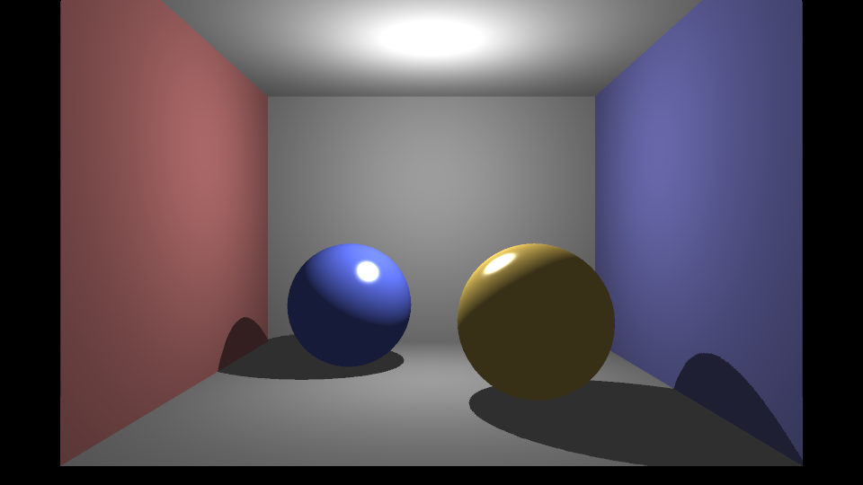

> 图 5-1：scene08（Cornell-box 式布景）光栅化渲染。可见红 / 蓝侧墙、灰地板天花、金色 Phong 球与蓝色 Blinn-Phong 球，点光源立方体阴影贴图产生的接触阴影。**注意：与右侧路径追踪图对比，阴影内部与背光面偏平（仅靠恒定环境光提亮），没有颜色渗透（color bleeding）。**

纹理贴图的光栅 / 光追渲染结果见第 8.4 节（图 8-1）。

> 📄 光栅化每个功能从数学到源码的逐行精讲另见仓库 `RASTERIZER_INTERNALS.md`。

---
## 06. Ray Tracing 光线追踪

光线追踪"以像素为中心"：为每个像素发射主光线，与场景求交，在交点做着色。本项目的光追与路径追踪共用 `Renderer::GetRadiance`——**直接光照部分**就是经典 Whitted 式光追（可见性 + 硬阴影 + 局部光照），**间接光照部分**（第 7 章）才升级为路径追踪。

```text
Camera
 ↓  GetRay(x,y)：屏幕像素 → 逆 MVP → 世界空间主光线
Primary Ray
 ↓
Ray-Scene Intersection   Scene::Intersect：线性遍历，maxt 收缩取最近交点
 ↓
Visibility (Shadow Ray)  向每个光源发阴影射线，被遮挡则跳过该光源
 ↓
Shading                  局部坐标系下 BRDF · L · cosθ 累加
 ↓
Pixel
```

### 6.1 Primary Ray 主光线生成

`Camera::GetRay(x,y)` 构造屏幕像素齐次坐标 $(x,y,0,1)$，乘以逆组合矩阵变换回世界空间，做透视除法 $\div w$ 还原真实 3D 点，再由相机位置指向该点得到单位方向 $\mathbf d$。SSAA 在像素内 $(x,y)\sim(x+1,y+1)$ 范围随机取 $N$ 个子样本（`RenderPixel`），每个子样本发一条光线后平均。

### 6.2 Intersection 交点信息

`Scene::Intersect` 线性遍历所有 `SceneObject`，每次命中就把 `ray.maxt` 收缩到 `isect.t`，使后续物体只有更近才会覆盖——由此得到最近交点。交点 `Intersection` 携带：

- **Position** 世界坐标 $\mathbf o+t\mathbf d$
- **Normal** 法线（三角形为面法线；网格 / 网格化球为顶点法线重心插值的平滑法线）
- **UV** 纹理坐标（网格 / 球插值得到）
- **Material** 来自命中的 `SceneObject`
- **Distance** $t$

> 注意：场景级与网格级求交**均为线性扫描，无 BVH 等加速结构**，靠 `maxt` / `closest` 收缩求最近。这是当前最大的性能瓶颈（见第 11、13 章）。

### 6.3 Visibility 可见性与硬阴影

对每个光源，从交点向光源位置构造阴影射线（`mint=1e-3` 避免自交，`maxt=` 到光源距离）。若 `Scene::Intersect` 命中任何遮挡物，则该光源对此点无贡献（跳过累加），形成**硬阴影**。光源位置由 `Light::GetRadiance(p, sourcePos)` 输出：点光源即自身位置，平行光沿方向取一个极远点（$p-\text{dir}\times10^5$）。

---

## 07. Path Tracing 路径追踪

这是报告的核心章节。路径追踪在直接光照之外，通过**递归采样间接光**求解完整渲染方程，让画面获得颜色渗透、软过渡等全局光照效果。

### 7.1 Rendering Equation 渲染方程

Kajiya（1986）渲染方程描述点 $x$ 沿方向 $\boldsymbol\omega_o$ 出射的辐射度：

$$L_o(x,\boldsymbol\omega_o)=L_e(x,\boldsymbol\omega_o)+\int_{\Omega} f_r(x,\boldsymbol\omega_i,\boldsymbol\omega_o)\,L_i(x,\boldsymbol\omega_i)\,(\mathbf n\cdot\boldsymbol\omega_i)\,\mathrm d\boldsymbol\omega_i$$

- $L_o$：出射辐射度（我们要求的像素颜色）。
- $L_e$：自发光（本项目当前材质**无自发光项**，光源单独作为 `Light` 处理，故这一项实际为 0）。
- $f_r$：BRDF，描述入射光被反射的比例（第 8 章）。
- $L_i$：入射辐射度（可能来自光源，也可能来自其他表面的反射——这正是递归的来源）。
- $\mathbf n\cdot\boldsymbol\omega_i=\cos\theta$：入射方向与法线夹角的余弦，几何衰减。
- $\Omega$：法线所在的上半球。

本项目把这个积分拆成**直接光照**（光源直接贡献，遍历 `Light` 求和 + 阴影射线）与**间接光照**（半球采样递归）两部分（`Renderer::GetRadiance`）。

### 7.2 Monte Carlo Integration 蒙特卡洛积分

半球积分没有解析解，用蒙特卡洛估计。对随机变量 $X\sim p(x)$：

$$E[f(X)]=\int f(x)p(x)\,\mathrm dx$$

由此得到无偏估计量（**必须除以采样 pdf**）：

$$\hat L=\frac1N\sum_{i=1}^{N}\frac{f(x_i)}{p(x_i)}$$

样本数 $N$ 越大，估计方差越小、图像噪点越少——这就是 SPP（samples per pixel）的意义。收敛速率为 $O(1/\sqrt N)$：噪声（标准差）随 $\sqrt N$ 下降，即想让噪声减半需要 4 倍样本。第 10 章的 SPP 实验定量验证了这一点。

### 7.3 Importance Sampling 重要性采样（余弦加权）

本项目采用**余弦加权半球采样**（`CosineSampleHemisphere`，Malley 方法：单位圆盘均匀采样后投影到半球），其 pdf 为

$$p(\boldsymbol\omega)=\frac{\cos\theta}{\pi}$$

把它代入蒙特卡洛估计，被积式里的 $\cos\theta$ 与 pdf 分母的 $\cos\theta$ **恰好抵消**：

$$\frac{f_r\cdot L_i\cdot\cos\theta}{\cos\theta/\pi}=f_r\cdot L_i\cdot\pi$$

因此代码里间接光贡献只剩 `brdf * Li * PI`（`GetRadiance`）。**为什么降方差？** 因为渲染方程被积函数本身带 $\cos\theta$ 权重（掠射方向贡献小），按 $\cos\theta$ 分布采样等于"把样本花在贡献大的方向上"，比均匀半球采样方差小得多——均匀采样常需上千 SPP 才收敛，余弦采样几十次即可。

### 7.4 Recursive Path Tracing 递归路径追踪

```text
Camera → Primary Ray → Intersection
                          ↓  直接光(光源+阴影) + 采样一个入射方向 wi'
                       Secondary Ray → Intersection
                          ↓  ...递归...
                       Light / 未命中(黑背景)
```

递归控制参数（`GetRadiance`）：

- **Maximum Depth**（`mMaxDepth`，实验取 12）：递归深度硬上限，超过返回黑色，防止无限递归。
- **Russian Roulette 俄罗斯轮盘赌**（`mMinDepth`，取 3）：深度 $\ge$ `mMinDepth` 后，以存活概率 $p=0.8$ 抛硬币；若终止返回 0，若存活则结果乘补偿因子 $1/p$。这样期望值不变（**无偏**），又避免固定深度截断能量或递归过深。
- **Emission 自发光**：当前无（见 7.1）。
- **Indirect Lighting 间接光**：即上面递归得到的 $L_i$，是 color bleeding 等效果的来源。

**全局光照效果对比：**

| 路径追踪（间接光，spp=64，本次生成） | 光栅化（仅直接光+环境光，本次生成） |
|:---:|:---:|
| 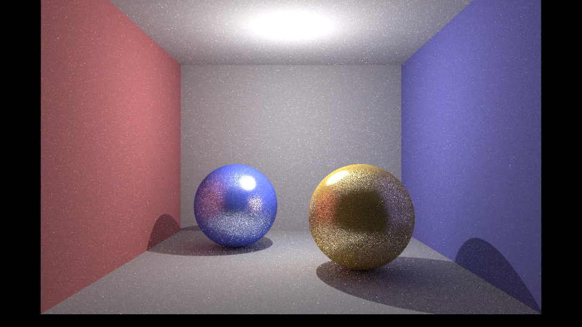 |  |

> 图 7-1：**为什么间接光能补足阴影层次？** 直接光照下，光源照不到的地方就是纯黑（光栅化靠恒定环境光勉强提亮，但整片死平）。路径追踪通过递归采样，让物体接收来自周围表面反射的光——红墙反射的光染红邻近的地板与球体（color bleeding），阴影里也有了柔和的环境反射，画面才真实。历史手动全局光照截图另见 `GI.png`。

---
## 08. Materials and Lighting 材质与光照

### 8.1 三种 BRDF

材质接口是纯虚函数 `BRDF(wo, wi, n, uv) → Color`（`Material.h`，实现全部 header-inline，`Material.cpp` 仅为占位）。约定：所有向量世界空间且已归一化，`wo` 指向相机，`wi` 指向光源，`n` 为法线。三种材质均**无独立环境光项**。

| 材质 | 漫反射项 | 高光项 | 构造参数 |
|------|----------|--------|----------|
| **Lambert** | $\text{albedo}/\pi$ | — | `albedo` |
| **Phong** | $k_d/\pi$ | $k_s\cdot\dfrac{n+2}{2\pi}\cdot\max(\mathbf R\cdot\mathbf w_o,0)^n$ | `diffuse, specular, shininess` |
| **Blinn-Phong** | $k_d/\pi$ | $k_s\cdot\dfrac{n+8}{8\pi}\cdot\max(\mathbf n\cdot\mathbf H,0)^n$ | `diffuse, specular, shininess` |

- **Lambert**：纯漫反射，反射比恒为 $\text{albedo}/\pi$，与方向无关。$1/\pi$ 是能量守恒归一化（半球积分 albedo 才不超过 1）。
- **Phong**：高光用**反射向量** $\mathbf R=\text{reflect}(-\mathbf w_i,\mathbf n)$，取 $\max(\mathbf R\cdot\mathbf w_o,0)^n$。
- **Blinn-Phong**：高光用**半程向量** $\mathbf H=\text{normalize}(\mathbf w_o+\mathbf w_i)$，取 $\max(\mathbf n\cdot\mathbf H,0)^n$。大掠射角下比 Phong 更自然，同等视觉效果 shininess 需约 2~4 倍。
- $(n+2)/2\pi$ 与 $(n+8)/8\pi$ 是高光项的**能量守恒归一化因子**；`shininess` 在构造时被 `max(·,1)` 钳制。

**漫反射贴图**：材质可挂 `mDiffuseMap`（非拥有指针）。`SampleAlbedo(uv, fallback)` 在贴图有效时返回 `Texture::Sample(uv)`（双线性采样 + sRGB→线性），否则回退到常量 albedo。光追与光栅共用同一套采样，保证一致。

**BRDF 求值坐标系**（光追）：`GetRadiance` 在交点用法线建局部坐标系（z 轴对齐法线），把 `wo`、`wi` 都转入局部系再求 BRDF。好处是法线恒为 $(0,0,1)$，$\cos\theta$ 直接是方向 z 分量，余弦采样也天然在此系生成；直接光与间接光在同一坐标系下求值，保证高光正确。

### 8.2 光源模型

`Light::GetRadiance(p, sourcePos)` 返回到达 $p$ 的辐照度并输出光源位置（供阴影射线用）。

| 光源 | 特点 | 衰减 |
|------|------|------|
| **DirectionalLight** | 无限远，方向一致 | 无衰减；`sourcePos = p - dir×1e5` |
| **PointLight** | 向四周均匀发光 | $1/(c+b\cdot R+a\cdot R^2)$，$R$ 为距离 |
| **SpotLight** | 锥形光束 | 距离衰减 × 锥角衰减 |

- **点光源衰减**系数映射：`Attenuations` 的 `.x` 是二次项、`.y` 线性项、`.z` 常数项（与直觉相反，需注意）。
- **聚光灯锥角**：$\cos\theta=\mathbf L\cdot\mathbf{dir}$，锥角衰减 $k_2=\text{clamp}\big(\frac{\cos\theta-\cos\theta_\text{outer}}{\cos\theta_\text{inner}-\cos\theta_\text{outer}},0,1\big)$，在内外锥之间做余弦空间线性过渡；最终 $L=\text{intensity}\cdot k_1\cdot k_2$。
- 只有 PointLight 重写了 `GetPointLightPosition`，因此光栅化只为点光源构建阴影贴图。

### 8.3 材质渲染结果

scene08 同时包含三类材质：墙 / 地板 / 天花是 **Lambert**（红、蓝、灰），一个球是 **Phong**（金色暖高光），另一个球是 **Blinn-Phong**（蓝色淡高光）。上文图 5-1 / 7-1 即为该场景。

为做**单变量受控对比**，另构造了 `scene_brdf_compare.xml`——三个同色球仅 BRDF 不同，见第 10 章 Experiment 3 与图 10-2。可清晰看到：Lambert 无高光、Phong 高光紧凑、Blinn-Phong 同 shininess 下高光更宽更柔。

### 8.4 纹理映射（漫反射贴图）

材质可挂一张**漫反射贴图**（固有色纹理），覆盖常量 albedo。整条纹理链路：

```text
Texture::Load (stb_image)          读 PNG/JPG，sRGB → 线性（除 gamma）
        ↓
交点 / 片元的 UV（重心插值得到）
        ↓
Texture::Sample(uv)                双线性采样（bilinear）四邻域加权
        ↓
Material::SampleAlbedo(uv, 固有色)  贴图有效则用采样值，否则回退常量
        ↓
参与 BRDF 的漫反射项（albedo/π）
        ↓
输出前线性 → sRGB（gamma 1/2.2）
```

关键点（与 `Texture.cpp` / `Material.h` 一致）：

- **UV 来源**：`Mesh` 从 OBJ 的 `vt` 读取纹理坐标，求交时用重心坐标插值（光追）/ 透视校正插值（光栅），得到逐点 UV。`cube_uv.obj` 带 UV，故立方体六面能正确贴图。
- **双线性采样**：`Texture::Sample` 取 UV 邻近 4 个纹素按小数权重混合，避免最近邻的块状锯齿。
- **色彩空间闭合**：贴图在加载时 sRGB→线性（`Texture::Load`），参与线性空间光照计算，最后输出再线性→sRGB。若省掉任一步，整帧会明显偏暗或偏亮。这是"贴图看起来发灰 / 发暗"类 bug 的常见根因。
- **两条管线一致**：光追（`GetRadiance` 传 `isect.uv`）与光栅（`ShadePixel` 传插值 uv）调用同一套 `BRDF(..., uv)`，故贴图在两条管线下表现一致。

**纹理渲染结果**（`scene_tex.xml`：带 UV 的立方体 `cube_uv.obj` + 灰色地面 + 点光源）：

| 光线追踪（本次重新生成，spp=96） | 光栅化（本次重新生成） |
|:---:|:---:|
| 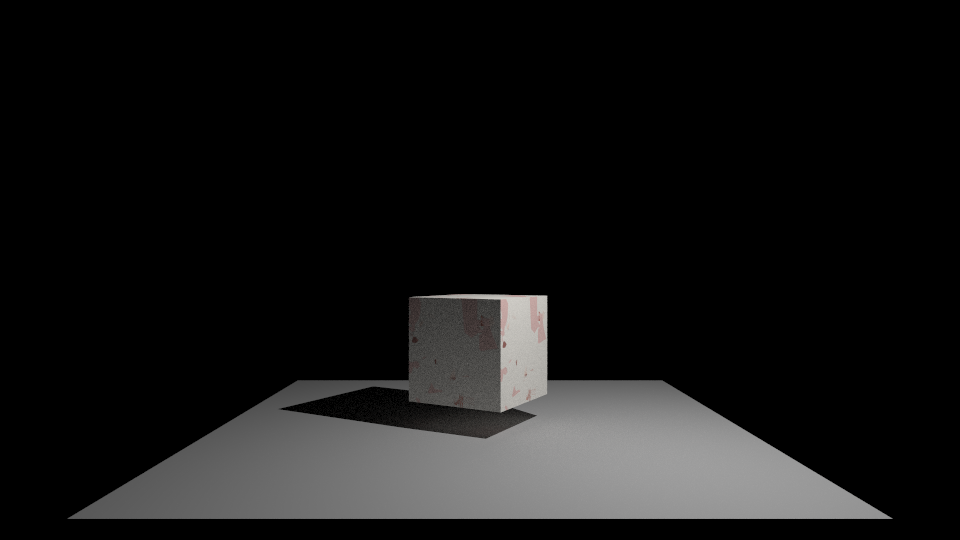 | 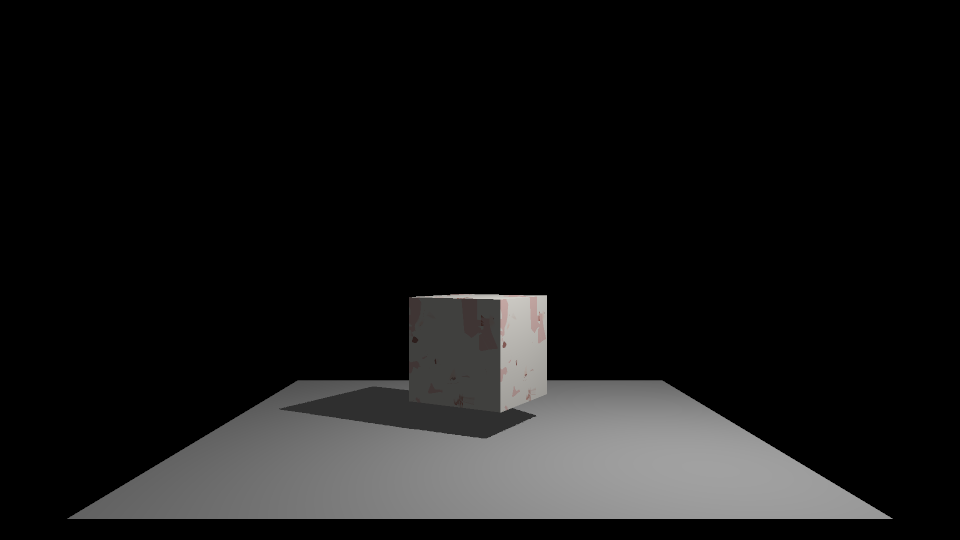 |

> 图 8-1：同一带 UV 立方体在两条管线下的漫反射贴图。可见贴图细节、透视正确的 UV 插值、以及两条管线一致的固有色。历史手动截图（作者早期验证 UV 用）另见 `光线追踪uv贴图.png`、`光栅贴图uv.png`（更早期版本，画面较暗）。
>
> 说明：`cube_uv.obj` 尺寸较小、置于黑色背景中，故整帧大部分是黑的；立方体本身已正确受光贴图（球心区域最大亮度 ~210，纹理色彩方差明显）。为让贴图更清楚，出图用的是把点光源强度调亮后的 `scene_tex_bright.xml`。

---

## 09. Sampling 采样

项目中出现的采样有两类：

1. **SSAA 抗锯齿采样**（`RenderPixel`）：像素内 $(x,y)\sim(x+1,y+1)$ 均匀随机取 $N$ 个子样本，颜色平均。用于消除几何边缘锯齿。
2. **余弦加权半球采样**（`CosineSampleHemisphere`，第 7.3 节）：用于路径追踪间接光方向采样，pdf $=\cos\theta/\pi$，降方差。

> 关于 $N=1,4,16,64,256$ 的对照：本项目的 `SamplePerPixel` 同时承担 SSAA 子样本数与路径追踪每像素样本数两个角色（每个子样本各跑一次完整 `GetRadiance`），因此增大 SPP 同时降低几何锯齿与蒙特卡洛噪声。第 10 章 Experiment 1 用纯 Lambert 康奈尔盒（scene082）对此做了定量测量，实测 RMSE 逐档比值几乎精确等于 $1/\sqrt4=0.5$。
>
> **未实现 / 未测试的采样对照**：项目只实现了余弦加权采样，**没有均匀半球采样的可切换实现**，因此"Experiment 2：Uniform vs Cosine"标注为未进行系统测试（不为报告临时加功能，见任务要求原则）。

---

## 10. Experiments 实验

> 平台：AMD Ryzen 9 7940HX（16C/32T），Windows 10，MSVC 14.51 Release/x64。分辨率 960×540。各实验使用的场景不同（Experiment 1 用纯 Lambert 康奈尔盒 scene082；Experiment 3 用受控对照 scene_brdf_compare；Experiment 4/5 用混合材质 scene08），各表已注明。计时由无窗口基准接口 `Renderer::RenderHeadless()` 用 `std::chrono::high_resolution_clock` 测量（仅渲染耗时，不含窗口 / 磁盘）。每项配置运行 3 次取平均。方法细节见附录 A。

### Experiment 1：SPP 对噪声与耗时的影响

- **Question**：增大每像素采样数 SPP，噪声如何下降、耗时如何增长？是否符合蒙特卡洛 $O(1/\sqrt N)$ 收敛？
- **Setup**：raytrace 模式，全部 32 线程，minDepth=3、maxDepth=12，SPP∈{1,4,16,64,256}。**场景 scene082.xml**（纯 Lambert 康奈尔盒：灰色磨砂球 + 红/蓝侧墙 + 点光源），漫反射表面能干净体现全局光照收敛，比带高光的场景更适合观察噪声。
- **Variables**：自变量 SPP；因变量渲染时间、噪声（以 256spp 图为参考的 RMSE / PSNR）。
- **Results**：

| SPP | 渲染时间 (ms) | 相对 1spp 耗时 | RMSE vs 256spp | PSNR (dB) |
|----:|-------------:|--------------:|---------------:|----------:|
| 1   | 120.0   | 1.0×   | 0.0544 | 25.29 |
| 4   | 293.9   | 2.4×   | 0.0274 | 31.23 |
| 16  | 981.4   | 8.2×   | 0.0136 | 37.30 |
| 64  | 3891.9  | 32.4×  | 0.0075 | 42.52 |
| 256 | 15430.6 | 128.6× | 0（参考）| ∞ |

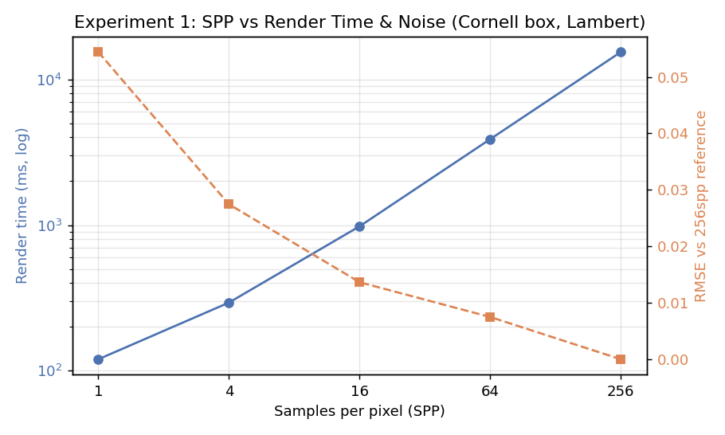

- **Analysis**：
  - **耗时**近似随 SPP 线性增长（1→4→16→64→256 每步约 4×，耗时也约 4×：120→294→981→3892→15431 ms）。1spp→4spp 只涨 2.4× 而非 4×，是因为固定开销（场景加载、线程创建、内存分配）在低 SPP 时占比更高。
  - **噪声**随 SPP 增大而下降，RMSE 从 0.0544（1spp）降到 0.0075（64spp）。逐档看 4× 样本对应的 RMSE 比值：0.0544→0.0274（比 0.50）、0.0274→0.0136（比 0.50）、0.0136→0.0075（比 0.55），**几乎精确等于理论值 $1/\sqrt4=0.5$**——即样本翻 4 倍、噪声减半。这条纯漫反射场景的数据非常干净地印证了蒙特卡洛 $O(1/\sqrt N)$ 收敛。代价对称：想让噪声再减半就要 4× 时间，这解释了为何路径追踪"最后一点噪声"极其昂贵。

**不同 SPP 视觉对比（scene082 康奈尔盒）：**

| 1 spp | 4 spp | 16 spp |
|:---:|:---:|:---:|
| 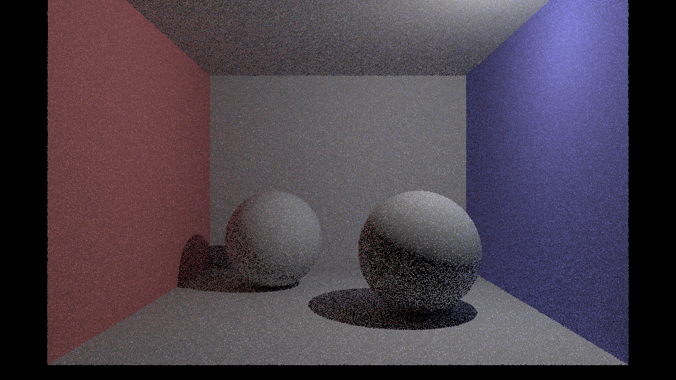 | 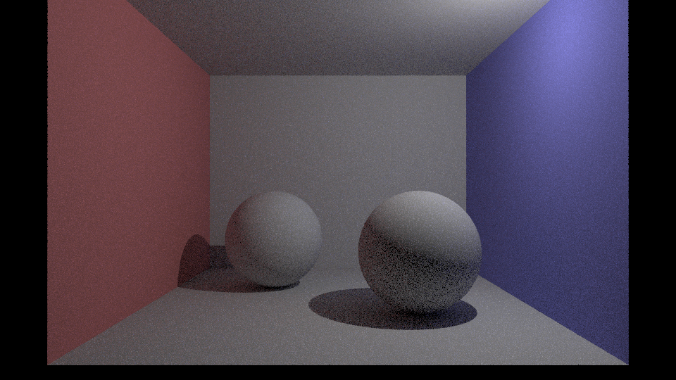 |  |

| 64 spp | 256 spp（参考） |
|:---:|:---:|
|  | 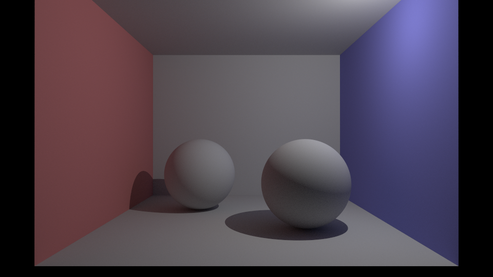 |

> 图 10-1：1spp 噪点密布，4spp 起噪声肉眼可见地减半，16spp 明显改善，64spp 已相当干净，256spp 作为收敛参考。可见地面与墙角的软阴影 / 颜色渗透随 SPP 增大逐渐平滑——这些正是间接光贡献、也正是噪声的主要来源。

### Experiment 2：采样策略（Uniform vs Cosine）

**未进行系统测试。** 项目只实现了余弦加权采样，没有可切换的均匀半球采样实现。为遵循"不为报告临时扩展渲染器"的原则，此实验留待未来。理论预期（第 7.3 节）：余弦加权因把样本集中在高贡献方向，方差应显著低于均匀采样。

### Experiment 3：不同光照模型（Lambert / Phong / Blinn-Phong）

- **Question**：在**完全相同**的相机、光源、几何、漫反射色下，三种 BRDF 的视觉差异是什么？高光项如何改变外观？
- **Setup**：为此实验专门构造受控对照场景 `scene_brdf_compare.xml`——三个**同半径、同漫反射灰 (0.5)** 的球并排（左 Lambert / 中 Phong / 右 Blinn-Phong），Phong 与 Blinn-Phong 用**相同的白高光、相同 shininess=64**；单点光源置于正上偏前，使三球高光位置一致。除 BRDF 外无任何其他变量。raytrace，spp=64。
- **Variables**：自变量仅材质 BRDF；相机 / 光照 / 几何 / 漫反射色全部固定。
- **Results**：

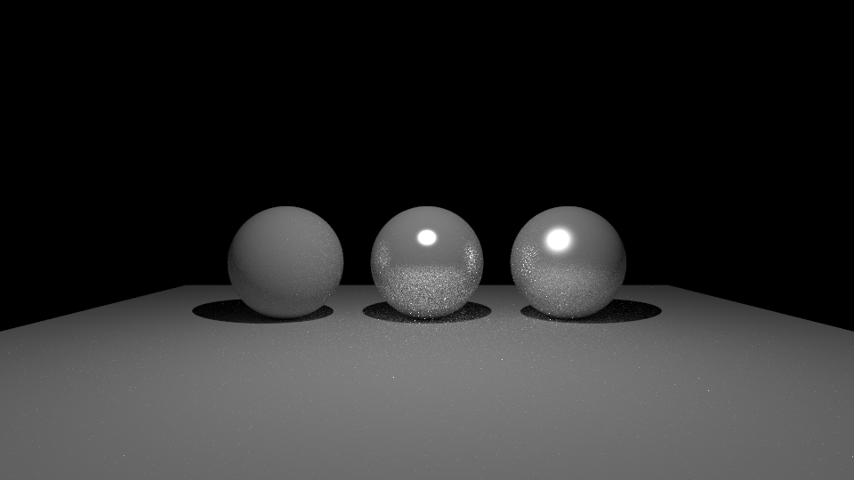

> 图 10-2：左 Lambert，中 Phong，右 Blinn-Phong。三球漫反射基底一致，差异全部来自高光项。

为量化高光，在三球中心区域统计像素亮度（见附录 A 脚本）：

| 材质 | 高光项 | 球心区域最大亮度 | 高光像素数 (>240) | 观察 |
|------|--------|:---------------:|:----------------:|------|
| Lambert | 无 | 147 | 0 | 纯漫反射，全无高光，表面均匀 |
| Phong | $\max(\mathbf R\cdot\mathbf w_o,0)^n$ | 255 | 263 | 高光**紧凑集中**，斑点小而锐 |
| Blinn-Phong | $\max(\mathbf n\cdot\mathbf H,0)^n$ | 255 | 432 | 相同 shininess 下高光**更大更柔** |

- **Analysis**（不做"谁更好"的结论，而是分析差异来源）：
  - **Lambert vs 有高光**：Lambert 球完全靠 $\text{albedo}/\pi$ 的漫反射，明暗只随 $\cos\theta$ 变化，没有视线相关的亮斑；加了高光项的两球则在特定视线-光源夹角处出现镜面亮斑。
  - **Phong vs Blinn-Phong（同 shininess=64）**：Blinn-Phong 的高光像素数（432）明显多于 Phong（263），即**同样的 shininess 下 Blinn-Phong 高光更大更柔**。这是数学上的必然：Phong 用反射向量 $\mathbf R$ 与视线 $\mathbf w_o$ 的夹角，Blinn-Phong 用半程向量 $\mathbf H$ 与法线 $\mathbf n$ 的夹角，而 $\angle(\mathbf n,\mathbf H)$ 约为 $\angle(\mathbf R,\mathbf w_o)$ 的一半，故相同指数下 Blinn-Phong 衰减更慢、高光更宽。这也是经验法则"Blinn-Phong 要达到 Phong 同等高光大小，shininess 需调大约 2~4 倍"的由来。
  - 两种高光项各自的归一化因子 $(n+2)/2\pi$ 与 $(n+8)/8\pi$ 用于能量守恒，使高光强度不随 shininess 任意膨胀。

### Experiment 4：Rasterization vs Ray Tracing

- **Question**：两条管线在可见性、阴影、间接光、性能、实现复杂度上如何权衡？
- **Setup**：同一 scene08，960×540。光栅化 SSAA=1；光追 spp=64，全 32 线程。
- **Results**：

| 管线 | 渲染时间 (ms) | 可见性 | 阴影 | 间接光 / GI |
|------|-------------:|--------|------|-------------|
| Rasterize (SSAA=1) | 192.4 | Z-buffer 深度测试 | 立方体阴影贴图（点光源） | ❌ 无（仅恒定环境光近似） |
| Ray Trace (spp=64) | 4061.3 | 光线-场景求交 | 阴影射线（硬阴影） | ✅ 递归间接光（color bleeding） |

耗时比约 **21×**（光追 spp=64 相对光栅化）。

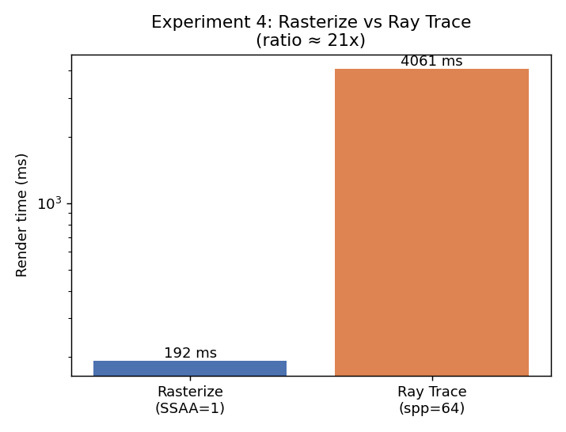

- **Analysis**（不做"光追更好"的简单结论）：
  - **两者解决问题的方式不同**。光栅化"以图元为中心"，把三角形投影到屏幕、Z-buffer 解决可见性，对"每个三角形覆盖哪些像素"这个问题极其高效；但阴影、反射、间接光都需要额外机制（阴影贴图、环境光近似）去"模拟"，因为光栅化本身没有光线概念。
  - 光追"以像素为中心"，可见性、阴影、间接光**统一为光线求交**，物理上更自然、更容易得到全局光照；代价是每像素多条光线、多次递归，且当前无加速结构，耗时高一个数量级。
  - **实现复杂度**：光栅化的透视校正、深度精度、阴影贴图各有坑（见第 12 章的 Z-fighting）；光追的坐标系、pdf、俄罗斯轮盘、自交偏移各有坑。两者复杂度"换了个地方"，并非谁一定简单。
  - 结论：**光栅化适合快速预览几何与直接光，光追适合追求真实全局光照**，二者是互补工具，本项目保留两条管线正是为了对照学习。

### Experiment 5：多线程扩展性

- **Question**：路径追踪的多线程加速比如何？能否接近线性？瓶颈在哪？
- **Setup**：raytrace，spp=32，960×540，线程数∈{1,2,4,8,16,32}。加速比 $\text{Speedup}=T_1/T_N$，效率 $=\text{Speedup}/N$。
- **Results**：

| 线程数 | 渲染时间 (ms) | 加速比 | 并行效率 |
|-------:|-------------:|-------:|---------:|
| 1  | 41280.8 | 1.00×  | 100% |
| 2  | 20803.3 | 1.98×  | 99%  |
| 4  | 10354.8 | 3.99×  | 100% |
| 8  | 5238.8  | 7.88×  | 98%  |
| 16 | 3043.8  | 13.56× | 85%  |
| 32 | 1985.8  | 20.79× | 65%  |

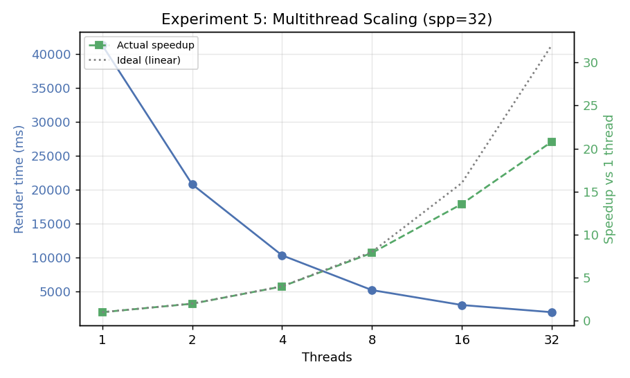

- **Analysis**：
  - **1→8 线程近乎理想线性**（效率 98–100%）。路径追踪是天然易并行（embarrassingly parallel）负载：像素间完全独立，调度用 `std::atomic<int>` 的 `fetch_add` 无锁领取像素索引，几乎无同步开销。
  - **16 线程效率降到 85%，32 线程降到 65%**。7940HX 是 **16 物理核 + SMT（32 逻辑线程）**：前 16 线程尚能占满物理核，16→32 主要靠超线程共享同一物理核的执行单元，收益递减；同时内存带宽（每条光线要读场景 / 贴图数据）成为共享瓶颈。这与"逻辑线程翻倍 ≠ 算力翻倍"的预期一致。
  - **CPU 利用率 / 同步 / 内存瓶颈**：无锁原子调度使同步几乎不是瓶颈；主要瓶颈是 SMT 资源竞争与内存带宽。若未来加入 BVH 降低每光线的访存量，高线程数下的效率有望回升。

### Experiment 6：BVH

**未实现，未进行测试。** 当前 `Mesh::Intersect` 与 `Scene::Intersect` 均为线性遍历。按任务要求，不为报告临时实现 BVH。未来可对比 Naive vs BVH 在 $10^3\sim10^6$ 三角形下的求交次数与耗时（见第 14 章）。

---
## 11. Performance Analysis 性能分析

> 只和自己的渲染器比。不与 Unreal / Unity / Blender Cycles / OptiX 等做性能对比——那没有意义。

### 11.1 测试环境

| Parameter | Value |
|-----------|-------|
| CPU | AMD Ryzen 9 7940HX（16 物理核 / 32 逻辑线程） |
| OS / 编译器 | Windows 10，MSVC 14.51，Release，x64 |
| Threads | 1–32（默认取 `hardware_concurrency()` = 32） |
| Resolution | 960 × 540 |
| Samples (SPP) | 1 / 4 / 16 / 32 / 64 / 256（分实验） |
| Scene | scene08.xml（Cornell-box 式，约 12 三角形 + 2 网格化球 24×48≈2300 三角形/球） |
| 计时方式 | `std::chrono::high_resolution_clock`，仅渲染段，3 次平均 |

### 11.2 汇总观察

- **SPP vs 渲染时间**：近似线性。256spp（16.1 s）≈ 137× of 1spp（0.118 s），略低于 256×，因固定开销在低 SPP 占比更高。
- **单线程 vs 多线程**：spp=32 下 1 线程 41.3 s，32 线程 2.0 s，加速比 20.8×。1→8 线程效率 ≈ 100%，之后受 SMT 与内存带宽限制递减。
- **分辨率 vs 渲染时间**：未做系统扫描（只测了 960×540），但由于光追是逐像素独立负载，耗时应近似正比于像素数（面积）。标注为**未系统测试**。
- **三角形数 vs 渲染时间**：未做系统扫描。由于无 BVH，`Mesh::Intersect` 是 $O(\text{三角形数})$ 线性遍历，预期耗时随三角形数近似线性增长，大模型会显著变慢。标注为**未系统测试**（这也是最该加 BVH 的动机）。
- **加速结构 vs Naive**：无 BVH，无法对比。

### 11.3 瓶颈判断

当前主要成本在**路径追踪的光线-场景求交**：每像素 SPP 条主光线 × 递归深度 × 每次求交线性遍历所有图元 / 三角形。无加速结构使得三角形数一大就急剧变慢。多线程已把 CPU 并行度吃到接近物理核上限，进一步提速的方向是**算法层面（BVH）**而非堆线程。

---

## 12. Debugging and Failure Analysis 调试与失败分析

本章复述一个**真实经历**的恶性 bug（完整记录见仓库 `BUGLOG_uninitialized_meshtriangle.md`），不编造任何调试过程。

### Uninitialized MeshTriangle 导致的非确定性渲染

```text
Problem → Observation → Hypothesis → Investigation → Root Cause → Fix → Verification → Lesson
```

- **Problem**：给光栅化加了阴影贴图与光照后，渲染结果变得非确定——同一个可执行文件，每次跑出来都不一样。
- **Observation（现象）**：跨编译模式表现不一致：Debug 稳定但从不显示阴影；Release 每次运行都不同（多数无阴影）；MinSizeRel 有时有阴影；RelWithDebInfo 有时有阴影但光照方向像是反的。两个关键特征——**跨编译模式不一致**，且**同一 exe 跨次运行不一致**。
- **Hypothesis（假设）**：这两个特征强烈指向"读取了未初始化的局部内存"或数据竞争。因为纯逻辑 / 浮点 bug 是确定性的（每次一样），"每次都不同"几乎必然是未初始化内存或 race；而"Debug 稳定"是因为 MSVC Debug 会用固定模式（0xCC/0xCD）填充未初始化栈，把 UB "稳定地填错"。
- **Investigation（排查方法论）**：
  1. **症状分类**：由"每次都不同 + Debug 稳定"锁定"未初始化局部内存"方向。
  2. **复现**：在 g++ 上用离屏渲染 + FNV 帧哈希做**帧指纹**，`-O2` 下跑 5 次，出现不同哈希 → 非确定性复现成功。
  3. **定性**：加 `-ftrivial-auto-var-init=pattern`（强制初始化所有自动变量），5 次哈希全一致 → 确认是"读到未初始化局部变量"。
  4. **二分定位**：把该编译标志逐个 `.cpp` 单独施加，缩小到 `Rasterizer.cpp`（其中声明了局部 `std::vector<MeshTriangle> tris`）。
  5. **锁定类型**：怀疑落到 `MeshTriangle` 本身。
- **Root Cause（根因）**：`MeshTriangle` 的字段（`v`、`normal`、`vn`）当初**未初始化**（只有 `uv` 有默认值）。`glm::vec3` 是平凡类型，默认构造**不清零**，于是 `MeshTriangle tri;` 里装的是垃圾值。平滑着色时顶点法线 `vn` 会被逐像素重心插值，垃圾法线让 `dot(n,wi)` 变随机 → 明暗随机、背面剔除随机（阴影时有时无），甚至可能出 NaN/Inf。"每次不同"是因为未初始化内存读到的是 OS 残留 / 地址随机化后的任意值。
- **Fix（修复）**：在 `Geometry/Primitive.h` 中给 `MeshTriangle` 所有字段默认初始化（`v=0`、`normal=(0,0,1)`、`vn=0`、`uv=0`，即当前代码状态）。附带修复：`ShadowCubeMap::SelectFace` 的局部变量初始化以防 NaN 方向漏判；并把相机近 / 远裁剪面从 0.1/1000（10000:1）收紧，消除次要的 Z-fighting（这是一个同时存在的次要 bug）。
- **Verification（验证）**：修复后重跑帧指纹，在 `-O0/-O2/-Os` 多个优化级别、多次运行下哈希全部一致（`-O3 -ffast-math` 例外，属预期）——非确定性消失。
- **Lesson Learned（教训）**：
  1. **平凡类型不清零——"声明即初始化"**。
  2. **"每次运行都不同" = 未初始化内存或数据竞争**；"随优化级别变化" = UB 的信号。
  3. 用**工具与判据**（帧指纹 → `-ftrivial-auto-var-init` → 逐文件二分）定位玄学 bug，而不是靠肉眼读代码。
  4. **Debug 通过 ≠ 正确**：Debug 用固定填充模式反而会"稳定地掩盖" UB。
  5. 多个 bug 叠加时，先用区分性判据把它们**逐个隔离**。

> 完整侦破过程（含现象截图与诊断日志）见仓库 `BUGLOG_uninitialized_meshtriangle.md`。

---

## 13. Limitations 局限

诚实列出当前不足：

- **CPU only**：无 GPU 后端，性能受限于 CPU 并行度。
- **无空间加速结构**：场景级与网格级求交均为线性遍历，大模型（高三角形数）会急剧变慢——这是当前最大的性能与可扩展性瓶颈。
- **BRDF 有限**：只有 Lambert / Phong / Blinn-Phong 三种经验模型；无镜面反射 / 折射 / 玻璃，无金属度-粗糙度 PBR 工作流。
- **无自发光材质**：光源与材质分离，渲染方程的 $L_e$ 项实际为 0，无法做面光源 / 自发光物体。
- **数值鲁棒性有限**：Sphere 解析路径的法线变换未用逆转置（仅旋转+均匀缩放正确）；光栅化缺近平面裁剪（相机后方三角形整片丢弃）。
- **场景格式有限**：XML + OBJ；OBJ 不解析 `mtllib/usemtl`（贴图需手动挂）。
- **采样技术有限**：只有余弦加权半球采样；无多重重要性采样（MIS）、无光源采样（NEE），故面光源 / 强间接光场景收敛较慢。
- **无降噪**：完全靠堆 SPP 降噪，无任何 denoiser。
- **未系统测试的维度**：分辨率扫描、三角形数扫描、采样策略（Uniform vs Cosine）对比均未做（见第 10 章标注）。（光照模型受控对比已在 Experiment 3 补做。）

不隐藏这些——它们恰恰标出了下一步该学 / 该做什么。

---

## 14. Future Work 未来工作

只列**真正可能继续研究**的方向，按技术依赖排序：

```text
Current Renderer（当前：光栅 + 路径追踪，无加速）
      ↓
BVH / Acceleration            ← 最优先：解决线性求交瓶颈，大模型才可行
      ↓
Importance Sampling (NEE/MIS) ← 光源采样 + 多重重要性采样，强间接光更快收敛
      ↓
Advanced BRDF (PBR)           ← 金属度/粗糙度、镜面/折射，配套法线/金属/粗糙贴图
      ↓
Denoising                     ← 低 SPP + 降噪，逼近实时预览
      ↓
Real-Time Rendering
      ↓
Differentiable / Neural Rendering
```

近期最有价值且可控的一步是 **BVH**：它既能直接缓解第 11、13 章指出的瓶颈，又能作为一个独立、可量化（求交次数 / 加速比）的实验（对应 Experiment 6）。

---

## 15. Conclusion 结论

### 已完成

- 光栅化管线（Z-buffer + 重心坐标 + 透视校正插值 + SSAA + 点光源阴影贴图 + 纹理 + gamma）
- 光线追踪（主光线 + 场景求交 + 硬阴影）
- 路径追踪（渲染方程递归求解 + 余弦加权重要性采样 + 俄罗斯轮盘赌 + 全局光照）
- 材质（Lambert / Phong / Blinn-Phong + 漫反射贴图）
- 光照（平行光 / 点光源 / 聚光灯 + 距离与锥角衰减）
- 采样（SSAA + 余弦加权半球采样）
- 多线程（原子像素索引无锁调度，实测 32 线程 20.8× 加速）
- 数据驱动（XML 场景 + OBJ 导入）

### 学到

图形学数学（向量 / 矩阵 / 投影 / 坐标变换）、渲染方程与其数值求解、蒙特卡洛积分与重要性采样、C++（模板 / 多态 / 内存管理 / 多线程）、软件架构（两条管线共享场景数据）、以及一套**定位非确定性 UB 的调试方法论**。

### 当前定位

> FortuneRenderer is an educational and experimental CPU renderer rather than a production rendering system.
>
> FortuneRenderer 是一个教学与实验用途的 CPU 渲染器，而非生产级渲染系统。诚实地保留它的失败记录、性能瓶颈与未竟之处，比把它包装成"研究级框架"更有价值——这些正是学习过程的真实证据。

---

## 16. References 参考资料

真正参考过的资料：

- **Games101**（闫令琪，现代计算机图形学入门）——光栅化、变换、光线追踪、路径追踪基础
- [**Ray Tracing in One Weekend**](https://raytracing.github.io/) ——光追与路径追踪入门实现
- [**Physically Based Rendering (PBRT)**](https://www.pbr-book.org/) ——渲染方程、蒙特卡洛、重要性采样
- [**Real-Time Rendering, 4th Ed.**](https://www.realtimerendering.com/) ——光栅化管线、阴影、BRDF
- [**Möller–Trumbore 求交算法**](https://en.wikipedia.org/wiki/M%C3%B6ller%E2%80%93Trumbore_intersection_algorithm)
- [**Wavefront .obj 格式**](https://en.wikipedia.org/wiki/Wavefront_.obj_file)
- [**GLM 文档**](https://glm.g-truc.net/) / [**MiniFB**](https://github.com/emoon/minifb) / [**TinyXML2**](https://github.com/leethomason/tinyxml2)
- Kajiya, J. T. (1986). *The Rendering Equation.* SIGGRAPH.

> 未实际阅读的论文不列入。

---

## 附录 A：实验方法与可复现性

**为出图与计时新增的接口**（仅测量与离线出图用途，不改变渲染算法）。`main.cpp` 现提供三种运行模式：

| 模式 | 命令 | 用途 |
|------|------|------|
| 交互窗口 | `FortuneRenderer`（无参数） | 开窗实时显示（原始演示行为） |
| 控制台出图 | `FortuneRenderer render [选项]` | 无窗口渲染一帧 → 存 PNG + 打印耗时 |
| 测试 / 基准 | `FortuneRenderer test [选项]` | 跑固定实验组 → 控制台表格 + `results.csv` + 代表图 |

支撑接口（`source/Rendering/Renderer.{h,cpp}`）：

- `Renderer::RenderHeadless(int numThreads)`：分配缓冲、按当前模式渲染一整帧，光追用指定线程数并行并 `join` 后计时，返回毫秒。**不开窗、不进事件循环**，便于精确计时。
- `Renderer::SavePNG(path)` / `SavePPM(path)`：把像素缓冲（Windows `MFB_RGB` 格式 `0x00RRGGBB`）写成 PNG（依赖 `stb_image_write`）或二进制 PPM(P6)。

`render` 选项：`--mode raytrace|raster`、`--scene`、`--width`、`--height`、`--spp`、`--min-depth`、`--max-depth`、`--threads`、`--out`、`--ambient`、`--verbose`。
`test` 选项：`--outdir`、`--runs`（每项平均次数，默认 3）、`--quick`（缩短 SPP/线程集合）。计时用 `std::chrono::high_resolution_clock` 只计渲染段；`test` 模式内部用 RAII 静音场景加载日志，保持表格清爽。分析脚本 `bench_out/analyze.py` 负责求 RMSE/PSNR 与绘制图表。

**噪声度量说明**：以 256spp 渲染图作为"近似真值"参考，$\text{RMSE}=\sqrt{\text{MSE}}$、$\text{PSNR}=10\log_{10}(1/\text{MSE})$（像素归一化到 [0,1]）。参考图本身仍含残余噪声，故绝对值仅供**趋势对比**，非绝对真值误差。

**可复现命令示例**：

```bash
cmake -S . -B build
cmake --build build --config Release

# 控制台出图：光追 spp=64，全线程 → out.png
./build/Release/FortuneRenderer.exe render --mode raytrace --spp 64 --out out.png
# 光栅化出图
./build/Release/FortuneRenderer.exe render --mode raster --out raster.png

# 一键跑全部基准实验（SPP 扫描 / 光栅vs光追 / 线程扩展）
./build/Release/FortuneRenderer.exe test --outdir bench_out --runs 3
# 快速版（更小的 SPP 与线程集合）
./build/Release/FortuneRenderer.exe test --quick

# 复现报告各图（本报告用到的具体场景）：
# Experiment 1 的 SPP 序列图（纯 Lambert 康奈尔盒）
for s in 1 4 16 64 256; do
  ./build/Release/FortuneRenderer.exe render --scene scene082.xml --spp $s --out spp_$s.png
done
# Experiment 3 的光照模型受控对比
./build/Release/FortuneRenderer.exe render --scene scene_brdf_compare.xml --spp 64 --out brdf_compare.png
# 纹理贴图（光追 + 光栅）
./build/Release/FortuneRenderer.exe render --scene scene_tex_bright.xml --spp 96 --out tex_raytrace.png
./build/Release/FortuneRenderer.exe render --mode raster --scene scene_tex_bright.xml --out tex_raster.png

# 可选：用 analyze.py 计算 RMSE/PSNR 并绘制图表
python bench_out/analyze.py
```

**本报告新增的场景文件**（`source/SceneFiles/`）：`scene_brdf_compare.xml`（光照模型受控对比）、`scene_tex_bright.xml`（调亮点光源的纹理场景，基于原 `scene_tex.xml`）。Experiment 1 复用了仓库已有的 `scene082.xml`（纯 Lambert 康奈尔盒）。

**数据完整性声明**：本报告所有性能数字来自上述接口的实际运行（见 `bench_out/results.csv` 与 `summary.txt`）。未测量的维度已明确标注"未进行系统测试"，无任何编造的 FPS、加速比或实验结论。

*报告完 — FortuneRenderer Technical Report*

