# 实时软阴影技术完全指南
> 从 Shadow Mapping 到 Distance Field，从零开始的循序渐进讲解
>
> 面向有编程基础、但图形学和概率论刚入门的读者

---

## 如何阅读本文档

本文档的写作原则：

1. **每个数学符号第一次出现时，都会用一句话解释它是什么。**
2. **每个公式不会直接扔出来，而是先讲"我们遇到了什么问题"，再讲"为什么这个公式能解决问题"，最后才给出公式。**
3. **复杂推导会拆成一步一步，每一步都有文字说明"这一步干了什么"。**
4. **遇到抽象概念时，会用编程类比（你有 C++ 背景）或日常类比帮助理解。**


---

# 第零章：软阴影到底是什么？

## 0.1 从一个日常问题开始

想象你站在太阳底下，你的脚边有一个影子。现在问你一个问题：

> **你的脚边这个点，接收到了多少来自太阳的光？**

这个问题看起来很简单，但答案取决于一个关键因素：**太阳有多大？**

### 情况一：假设太阳是一个点

如果太阳是一个数学意义上的点（无限小），那么从太阳到你脚边这个点，只有**唯一一条光线**。

- 如果这条光线被你的身体挡住了 → 这个点完全没光 → 影子
- 如果这条光线没被挡住 → 这个点完全有光 → 不是影子

答案只有两种：**有光** 或 **没光**。非黑即白，没有中间状态。

这种影子的边缘是刀割一样锐利的，叫做 **硬阴影（Hard Shadow）**。

### 情况二：太阳是一个有面积的圆盘

但真实的太阳不是一个点，它是一个有面积的圆盘。从你脚边这个点往太阳方向看，太阳上的**每一个点**都在发射光线。

- 太阳上有些点发出的光线被你的身体挡住了
- 太阳上有些点发出的光线没被挡住，直接照到了这个点

所以答案不再是"有光/没光"，而是：

> **太阳上有百分之多少的面积，发出的光能到达这个点？**

- 100% 都能到达 → 完全亮
- 0% 能到达 → 完全黑（影子中心）
- 比如 60% 能到达 → 半明半暗（影子边缘的过渡带）

这种影子边缘有一个从亮到暗的渐变过渡带，叫做 **软阴影（Soft Shadow）**。

## 0.2 用"数光线"来理解软阴影

我们把上面的直觉变成数学。

假设太阳是一个面积为 $A_L$ 的发光面（$A$ 代表 Area，面积；下标 $L$ 代表 Light，光源）。

我们在太阳上均匀地取 $N$ 个采样点，每个点代表一条光线。对于脚边的点 $P$：

- $N_{\text{visible}}$ = 能到达 $P$ 的光线数量（没被挡住的）
- $N$ = 总光线数量

那么 $P$ 点接收到的光的比例就是：

$$V(P) \approx \frac{N_{\text{visible}}}{N}$$

比如取了 10 条光线，其中 7 条能到达，那 $V(P) = 7/10 = 0.7$，表示这个点接收到了 70% 的光。

> **这里的 $V(P)$ 叫做可见性函数（Visibility Function）**，它表示点 $P$ 能看到多少比例的光源。$V=1$ 表示完全能看到（全亮），$V=0$ 表示完全看不到（全黑），$0<V<1$ 表示部分能看到（半影）。

## 0.3 从离散求和到连续积分

上面的"数光线"是离散的：我们取了有限的 $N$ 个采样点。

但真实的太阳上有**无数个点**，每一个点都在发光。当我们把采样点取到无穷多（$N \to \infty$），每个采样点代表的面积趋近于无穷小（记作 $dA$，表示面积的微小增量），"数光线"就变成了"对整个光源面积积分"。

具体来说：

- 我们在光源上每一个微小面积 $dA$ 处，判断从这里发出的光能不能到达 $P$
- 能到达就记为 1，不能到达就记为 0，这个 0/1 函数记作 $V(P, L)$，表示"从光源上点 $L$ 出发的光线能不能到达 $P$"
- 把整个光源上所有这些 0/1 值加起来（积分），再除以光源总面积 $A_L$，就得到了平均可见性

所以最终的公式是：

$$\boxed{V(P) = \frac{1}{A_L} \int_{A_L} V(P, L)\, dA}$$

**逐符号解释**：

| 符号 | 含义 |
|------|------|
| $V(P)$ | 点 $P$ 的可见性（0到1之间） |
| $\frac{1}{A_L}$ | 除以光源总面积，求"平均" |
| $\int_{A_L}$ | 对整个光源面积积分（就是把无数个微小面积的值加起来） |
| $V(P, L)$ | 从光源上点 $L$ 到 $P$ 的单条光线可见性（0或1） |
| $dA$ | 光源上的微小面积元素 |

**用编程类比**：这个积分就像一个 for 循环：

```cpp
float V = 0.0;
for (每个微小面积 dA in 光源A_L) {
    V += V(P, L) * dA;   // 累加每个点的可见性
}
V /= A_L;  // 除以总面积，求平均
```

当循环的步长趋近于 0，for 循环就变成了积分。

> **整个实时软阴影领域，本质上都在干一件事：用尽可能低的计算成本，近似这个积分。**
>
> 因为直接对光源面积积分（也就是发射无数条光线）在实时渲染中太慢了，一帧只有 16.67ms，我们必须想各种办法来"作弊"近似这个积分。

## 0.4 硬阴影 vs 软阴影的直观对比

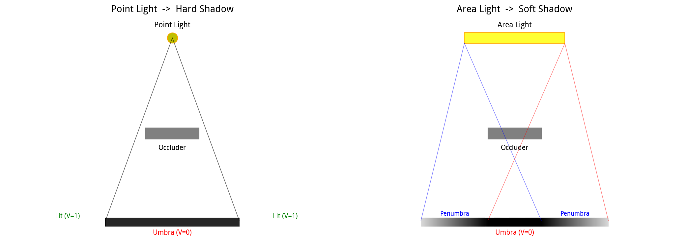

左图：点光源。所有光线来自同一个方向，影子只有"全黑"和"全亮"两种状态，边缘锐利。

右图：面积光源。光源左右边缘发出的光线被遮挡的位置不同，在地面上形成了一个从亮到暗的过渡带（Penumbra，半影）。

## 0.5 Umbra（本影）和 Penumbra（半影）

面积光源产生的阴影分三个区域：

| 区域 | 英文 | 含义 | 可见性 $V$ |
|------|------|------|------------|
| 全亮区 | Fully Lit | 光源完全可见，没有任何遮挡 | $V = 1$ |
| 半影区 | Penumbra | 光源部分被遮挡，一部分能看到一部分看不到 | $0 < V < 1$ |
| 本影区 | Umbra | 光源完全被遮挡，什么都看不到 | $V = 0$ |

软阴影的"软"，就体现在 Penumbra 这个过渡带上——它不是 0/1 跳变，而是一个连续的从 1 渐变到 0 的过程。

> **记忆技巧**：Umbra 来自拉丁语"阴影"，Penumbra 来自拉丁语"几乎是阴影"（paene = almost，umbra = shadow）。所以 Penumbra 就是"几乎是影子但还没完全黑"的那个过渡带。

---

# 第一章：渲染方程——阴影在光照中的位置

## 1.1 我们为什么要关心阴影？

阴影不是一个孤立的效果，它是光照计算的一部分。要理解阴影为什么重要，我们需要看一下**渲染方程（Rendering Equation）**。

渲染方程描述的是：一个表面点 $P$，往某个方向 $\omega_o$ 反射出去的光有多少。

## 1.2 渲染方程的完整形式

$$L_o(P, \omega_o) = \int_{\Omega} f_r(P, \omega_i, \omega_o) \, L_i(P, \omega_i) \, V(P, \omega_i) \, (\mathbf{n} \cdot \omega_i) \, d\omega_i$$

**逐符号解释**：

| 符号 | 含义 |
|------|------|
| $L_o(P, \omega_o)$ | 点 $P$ 往方向 $\omega_o$ 出射的光的亮度（Radiance） |
| $\int_{\Omega}$ | 对整个半球空间 $\Omega$ 积分（所有可能的入射方向） |
| $f_r(P, \omega_i, \omega_o)$ | BRDF（双向反射分布函数），描述材质如何把入射光 $\omega_i$ 反射到出射方向 $\omega_o$ |
| $L_i(P, \omega_i)$ | 从方向 $\omega_i$ 入射到 $P$ 的光的亮度 |
| $V(P, \omega_i)$ | 可见性函数，从 $P$ 往方向 $\omega_i$ 看，有没有被遮挡（0或1） |
| $\mathbf{n} \cdot \omega_i$ | 表面法线 $\mathbf{n}$ 和入射方向 $\omega_i$ 的点积，表示光线以多大角度照射表面（垂直照射最亮，掠射最暗） |
| $d\omega_i$ | 微小立体角元素（方向空间的"微小面积"） |

## 1.3 阴影在哪里？

注意渲染方程里的 $V(P, \omega_i)$ 这一项。

- 如果 $V = 0$（被遮挡了），那么这一项的整个乘积就是 0，意味着这个方向的光对 $P$ 点没有贡献
- 如果 $V = 1$（没被遮挡），这个方向的光正常贡献

所以**阴影就是可见性函数 $V$ 对光照的衰减作用**。没有 $V$，渲染方程算出来的就是"所有方向的光都能到达"的理想情况，不会有阴影。

> **对于面积光源**，$V(P, \omega_i)$ 不再是简单的 0/1，而是我们第零章讲的那个积分 $V(P) = \frac{1}{A_L}\int_{A_L} V(P,L)dA$。这就是为什么软阴影的数学本质是"对光源面积上的可见性积分"。

---

# 第二章：Shadow Mapping——一切的起点

## 2.1 我们遇到了什么问题？

要计算 $V(P, \omega_i)$，最直接的方法是：从 $P$ 出发，往光源方向发射一条光线，看看这条光线会不会和场景中的物体相交。

这叫做 **光线-场景求交（Ray-Scene Intersection）**。

问题是：光线求交在实时渲染中**太慢了**。场景中有成千上万个三角形，每条光线都要和所有三角形做相交测试，一帧要算几百万个像素，根本算不过来。

## 2.2 Shadow Mapping 的核心思想

Shadow Mapping 用了一个非常聪明的转换：

> **不直接计算每个像素到光源的遮挡，而是先从光源视角渲染一遍场景，把每个方向上最近表面的深度存下来。之后判断遮挡时，只需要比较"当前点的深度"和"存下来的最近深度"。**

把一个困难的"光线求交"问题，转换成了一个简单的"深度比较"问题。而深度比较是 GPU 极其擅长的。

## 2.3 什么是"深度"？

在解释 Shadow Map 之前，先明确一个概念：**深度（Depth）**。

当我们从某个视角（比如相机或光源）看场景时，每个像素对应一条视线。这条视线会和场景中的某个表面相交，这个交点到视角的**距离**（或者说沿视线方向的坐标值），就是这个像素的深度。

- 深度小 = 离视角近
- 深度大 = 离视角远

> **用编程类比**：深度就像一个 z 坐标。在视角空间中，相机在原点，往 -z 方向看。每个点的 z 值（取绝对值或经过透视变换后的值）就是深度。Shadow Map 存的就是从光源视角看出去，每个像素对应的最近表面的深度值。

## 2.4 什么是"光源空间"？

**光源空间（Light Space）** 就是以光源为原点建立的坐标系。

我们平时渲染场景用的是**相机空间（Camera Space）**，以相机为原点。但 Shadow Map 需要从光源的视角看场景，所以要把场景中的所有点变换到光源空间中。

变换到光源空间后，每个点有三个坐标 $(u, v, z)$：
- $(u, v)$ 是在光源"胶片"上的二维坐标（对应 Shadow Map 的纹理坐标）
- $z$ 是这个点在光源空间中的深度

## 2.5 Shadow Map 的数学定义

从光源看场景，对光源空间坐标 $(u, v)$，定义：

$$D(u, v) = \text{该方向上第一个可见表面的深度}$$

$D(u, v)$ 就是 Shadow Map——一张存储深度的二维纹理。纹理上的每个像素 $(u, v)$ 存了一个浮点数，表示从光源往这个方向看，最近的表面有多远。

## 2.6 如何用 Shadow Map 判断遮挡？

对于当前要着色的点 $P$：

**第一步**：把 $P$ 变换到光源空间，得到 $P_L = (u, v, z_r)$。
- $(u, v)$ 是 $P$ 在光源"胶片"上的位置
- $z_r$ 是 $P$ 在光源空间中的深度（下标 $r$ 代表 Receiver，接收者，也就是当前着色的这个点）

**第二步**：用 $(u, v)$ 去 Shadow Map 纹理中采样，得到这个方向上最近表面的深度 $D(u, v)$。

**第三步**：比较 $z_r$ 和 $D(u, v)$：

- 如果 $z_r > D(u, v)$：说明在 $P$ 之前（离光源更近的地方）还有另一个表面。$P$ 被这个表面挡住了 → $V = 0$
- 如果 $z_r \le D(u, v)$：说明 $P$ 就是这个方向上最近的表面，没有被挡住 → $V = 1$

写成公式：

$$\boxed{V(P) = \mathbf{1}[z_r \le D(u, v)]}$$

**符号解释**：$\mathbf{1}[\text{条件}]$ 叫做指示函数（Indicator Function），当条件为真时返回 1，条件为假时返回 0。就像 C++ 里的三元运算符 `(condition ? 1 : 0)`。

## 2.7 直观理解

```
光源
 ↓
遮挡物      深度 D(u,v) = 2.0  （离光源近）
 ↓
当前点 P    深度 z_r   = 5.0  （离光源远）

因为 5.0 > 2.0，所以 P 在遮挡物后面 → 被挡住了 → V=0
```

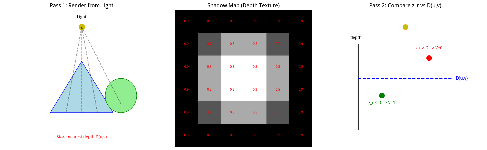

左图：第一趟渲染，从光源视角把场景的最近深度存到 Shadow Map 纹理中。
中图：Shadow Map 就是一张灰度图，每个像素存一个深度值（越浅表示越近）。
右图：第二趟渲染，对每个像素比较它的深度 $z_r$ 和 Shadow Map 存的最近深度 $D(u,v)$。

## 2.8 本质转换

Shadow Mapping 把：

$$\text{Ray-Scene Intersection（光线求交，慢）}$$

转换成了：

$$\text{Texture Fetch + Depth Compare（纹理采样 + 深度比较，极快）}$$

这就是为什么 Shadow Map 成为实时渲染的标配——它把问题转化成了 GPU 的主场操作。

## 2.9 Shadow Aliasing（阴影锯齿）从哪来？

Shadow Map 是一张离散纹理 $D[i, j]$，只有有限个像素。但真实场景中的可见性是一个连续函数 $V(u, v)$。

这就产生了一个矛盾：**连续函数被离散采样了**。

当一个屏幕像素刚好跨越阴影边界时：
- 真实情况：这个像素一半在阴影里一半在阴影外，应该是一个中间灰度
- Shadow Map：只能采样一次，得到 0 或 1

于是阴影边缘出现了锯齿状的走样（Aliasing）。这和纹理放大时的马赛克是同一个原理：采样率不够，高频信息丢失了。

> **用信号处理的语言说**：可见性函数在阴影边界处有一个从 0 到 1 的阶跃（无限高频），Shadow Map 的有限分辨率采样无法表示这个阶跃，于是产生了走样。

---

# 第三章：PCF——第一次尝试软化边缘

## 3.1 我们遇到了什么问题？

Shadow Map 只有硬阴影，边缘锯齿严重。怎么让边缘变柔和？

一个朴素的想法：**把阴影图模糊一下**。但这是错的——模糊深度图会得到一个不存在的"平均深度"，用这个平均深度去比较会产生错误的结果（后面会详细解释为什么）。

PCF 用了另一个思路。

## 3.2 PCF 的核心思想

PCF（Percentage-Closer Filtering，百分比渐近滤波）的想法：

> 别只比较一次了，在当前点周围的 Shadow Map 上采一堆样本，每个样本都做一次深度比较，最后把比较结果（0/1）取平均。

注意：**取平均的是比较结果，不是深度值**。这是 PCF 最关键的一点，也是最容易搞错的一点。

## 3.3 数学定义

假设有 $N$ 个 Shadow Map 采样点，每个点的深度是 $z_1, z_2, \cdots, z_N$。

对每个采样点，先做深度比较：

$$c_i = \mathbf{1}[z_r \le z_i]$$

$c_i$ 是 0 或 1，表示第 $i$ 个采样点处当前点有没有被挡住。

然后把所有 $c_i$ 取平均：

$$\boxed{V_{\text{PCF}} = \frac{1}{N} \sum_{i=1}^{N} c_i = \frac{1}{N} \sum_{i=1}^{N} \mathbf{1}[z_r \le z_i]}$$

比如 3×3 = 9 个采样点里，有 6 个比较通过（$c_i=1$），3 个没通过（$c_i=0$），那 $V_{\text{PCF}} = 6/9 = 0.667$。
**相当于这里依旧是去做一个加权平均（类似于一个特殊的卷积），得到的是一个 0 到 1 之间的软值**

这样，一个介于 0 和 1 之间的软值就出来了。

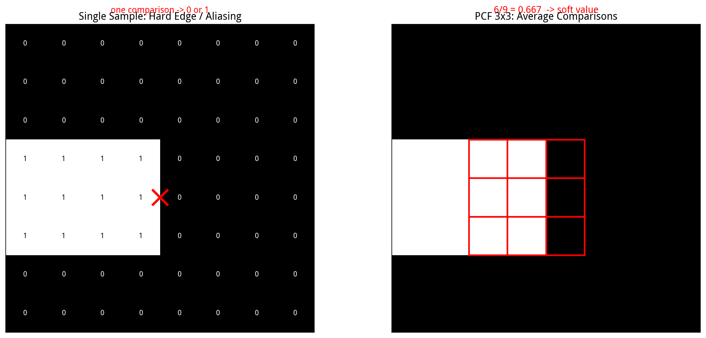

左图：单次采样，只能得到 0 或 1，边缘锐利有锯齿。
右图：3×3 采样，把 9 个比较结果取平均，得到 6/9 = 0.667 的软值。

## 3.4 为什么叫"Percentage-Closer"？

"Percentage-Closer"的意思是"越来越接近的百分比"。

它描述的是：随着滤波核在 Shadow Map 上移动，通过深度比较的样本占总样本的百分比（percentage），从 0% 逐渐变化（closer）到 100%。这个百分比的渐变就形成了软阴影的过渡带。

## 3.5 关键细节：为什么滤波的是"比较结果"而不是"深度"？

这是整个 Shadow Filtering 最容易搞错的地方，我用一个具体例子来说明。

### 错误做法：先平均深度，再比较

$$\bar{z} = \frac{1}{N} \sum_{i=1}^{N} z_i, \quad \text{然后比较} \quad \mathbf{1}[z_r \le \bar{z}]$$

**为什么错？** 举个例子：

假设滤波核里有 4 个采样点，深度分别是 $[1, 1, 10, 10]$。
- 平均深度 $\bar{z} = (1+1+10+10)/4 = 5.5$
- 假设当前点深度 $z_r = 3$
- 比较：$3 \le 5.5$ → 通过 → $V = 1$（全亮）

但真实情况是什么？4 个采样点里，2 个深度是 1（比 3 近，会挡住当前点），2 个深度是 10（比 3 远，挡不住）。真实可见性应该是 $2/4 = 0.5$（半亮）。

结果错误做法给出了 $V=1$（全亮），完全错了！

**根本原因**：平均深度 5.5 不对应场景中任何真实表面。场景里没有深度为 5.5 的物体，深度 5.5 是一个数学上的虚构值。用虚构值做比较当然会得到错误结果。

### 正确做法：先比较，再平均比较结果

对每个采样点单独比较：
- $z_1=1$：$3 \le 1$？否 → $c_1=0$
- $z_2=1$：$3 \le 1$？否 → $c_2=0$
- $z_3=10$：$3 \le 10$？是 → $c_3=1$
- $z_4=10$：$3 \le 10$？是 → $c_4=1$

平均：$V = (0+0+1+1)/4 = 0.5$，和真实情况一致。

> **PCF 本质上是在计算一个概率**：$P(X \ge z_r)$，即"滤波区域内，有多少比例的深度样本大于等于当前点深度（即没有被更近的物体挡住）"。这是一个离散概率估计器。

## 3.6 从 Monte Carlo 角度理解 PCF

回到第零章的那个积分：

$$V(P) = \frac{1}{A_L} \int_{A_L} V(P, L)\, dA$$

直接算这个积分需要对光源面积积分，太贵了。我们可以用 **Monte Carlo 积分**来近似。

Monte Carlo 积分的思想是：**用随机采样的平均值来近似积分**。

$$\boxed{V(P) \approx \frac{1}{N} \sum_{i=1}^{N} V(P, L_i)}$$

其中 $L_i$ 是在光源上随机取的 $N$ 个采样点。

PCF 干的就是这件事：在 Shadow Map 上取 $N$ 个采样点（对应光源上的 $N$ 个位置），每个点做一次可见性测试 $V(P, L_i) = \mathbf{1}[z_r \le z_i]$，然后取平均。

### Monte Carlo 的方差和噪声

Monte Carlo 估计器 $\hat{V}_N = \frac{1}{N}\sum_{i=1}^N V_i$ 的方差是：

$$\text{Var}(\hat{V}_N) = \frac{\text{Var}(V)}{N}$$

标准差（也就是噪声的大小）：

$$\sigma_{\hat{V}} = \frac{\sigma_V}{\sqrt{N}} \propto \frac{1}{\sqrt{N}}$$

**这意味着**：
- 采样数 $N$ 越多，噪声越小（但只按 $\sqrt{N}$ 的速度下降，要让噪声减半需要 4 倍的采样数）
- 采样数越多，计算开销越大（线性增长 $O(N)$）

这就是质量和性能的根本矛盾：**要干净的画面就得多采样，多采样就慢**。

> **用编程类比**：Monte Carlo 就像做民意调查。你不可能问全国所有人（精确积分），只能随机抽 1000 个人问（采样），然后用这 1000 人的平均意见来估计全国的意见。抽的人越多（N越大），估计越准，但成本越高。

## 3.7 PCF 的根本局限：它不是真正的软阴影

PCF 的滤波核大小 $K \times K$（比如 5×5）通常是固定的。这意味着：

- 靠近遮挡物的地方，阴影边缘的模糊程度 = 远离遮挡物的地方
- 但真实物理中，离遮挡物越远，半影应该越宽（回忆第零章的图）

所以 PCF 产生的是：

$$\boxed{\text{PCF} = \text{Filtered Hard Shadow（被滤波的硬阴影）}}$$

它解决了 aliasing（锯齿），但没有解决"软度应该随距离变化"这个物理问题。它只是把硬阴影的边缘模糊了一下，不是真正的面积光源软阴影。

---

# 第四章：PCSS——让阴影软度随几何变化

## 4.1 我们遇到了什么问题？

PCF 的滤波核是固定大小的，所以所有地方的阴影边缘模糊程度都一样。但真实世界中：

- 手离墙很近 → 影子边缘 sharp
- 手离墙很远 → 影子边缘很糊

阴影的软度应该由几何关系决定，而不是固定的。PCSS 就是来解决这个问题的。

## 4.2 PCSS 的核心思想

PCSS（Percentage-Closer Soft Shadows，百分比渐近软阴影）的关键洞察：

> 软阴影的宽度不是固定的，而是由**光源大小、遮挡物距离光源的距离、接收者距离光源的距离**三者共同决定的。

所以 PCSS 分三步走：

$$\boxed{\text{Blocker Search（找遮挡物）} \rightarrow \text{Penumbra Estimation（算半影宽度）} \rightarrow \text{PCF（自适应滤波）}}$$

## 4.3 第一步：Blocker Search（找遮挡物）

### 什么是 Blocker？

**Blocker（遮挡物）** 就是在当前点和光源之间、挡住了光线的物体。

在 Shadow Map 中，遮挡物就是那些深度比当前点小的样本：

$$d_B < d_R$$

其中 $d_B$ 是 Shadow Map 样本的深度（Blocker 的深度），$d_R$ 是当前接收点的深度（Receiver 的深度）。

### 怎么找？

在当前点周围的 Shadow Map 区域内，搜索所有满足 $d_B < d_R$ 的样本，这些就是潜在的遮挡物。然后计算它们的平均深度：

$$\bar{d}_B = \frac{1}{N} \sum_{i=1}^{N} d_{B, i}$$

### 为什么需要找遮挡物？

因为半影的大小取决于**接收者和遮挡物之间的距离**。

- 如果不知道遮挡物在哪，就不知道接收者离遮挡物有多远
- 不知道距离，就没法算半影应该有多宽
- 没法算半影宽度，就只能用固定核（退回 PCF）

所以 Blocker Search 是 PCSS 的基础——**先找到遮挡物的平均位置，才能算出阴影应该有多软**。

## 4.4 第二步：Penumbra 几何推导（核心数学）

这是 PCSS 最漂亮的部分——用初中几何的相似三角形，推导出半影宽度。

###  setup（设定）

考虑一个二维截面（把三维问题压扁成二维，方便画图和推导）：

- 光源是一条线段，宽度为 $w_L$（下标 L = Light）
- 遮挡物在距离光源 $d_B$ 的位置（下标 B = Blocker）
- 接收者（地面）在距离光源 $d_R$ 的位置（下标 R = Receiver）
- 半影在接收者上的宽度为 $w_P$（下标 P = Penumbra）

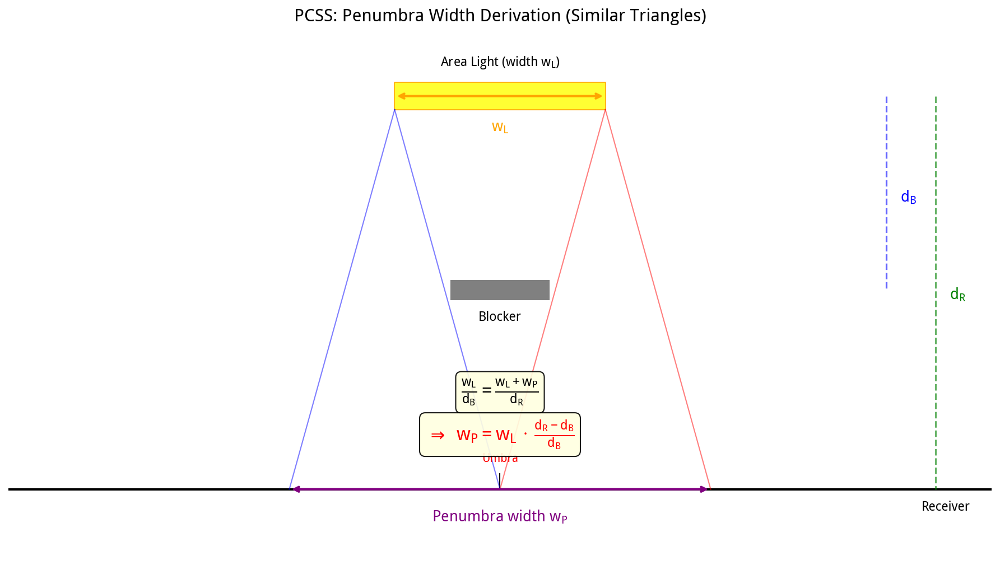

### 相似三角形

从光源的左边缘和右边缘分别作光线，穿过遮挡物的边缘，投射到接收者上。

观察由光源和遮挡物形成的小三角形，以及由光源和半影形成的大三角形：

- 小三角形：底边是光源宽度 $w_L$，高是遮挡物距离 $d_B$
- 大三角形：底边是 $w_L + w_P$（光源宽度 + 半影宽度），高是接收者距离 $d_R$

这两个三角形是**相似三角形**（因为它们共享光源处的顶角，且底边平行）。

相似三角形的对应边成比例：

$$\frac{w_L}{d_B} = \frac{w_L + w_P}{d_R}$$

### 代数推导

从相似三角形的比例式出发：

$$\frac{w_L}{d_B} = \frac{w_L + w_P}{d_R}$$

**第一步**：交叉相乘（等式两边同乘 $d_B \cdot d_R$）：

$$w_L \cdot d_R = d_B \cdot (w_L + w_P)$$

**第二步**：展开右边：

$$w_L \cdot d_R = d_B \cdot w_L + d_B \cdot w_P$$

**第三步**：把含 $w_L$ 的项移到左边（两边减 $d_B \cdot w_L$）：

$$w_L \cdot d_R - d_B \cdot w_L = d_B \cdot w_P$$

**第四步**：左边提取公因子 $w_L$：

$$w_L (d_R - d_B) = d_B \cdot w_P$$

**第五步**：两边除以 $d_B$，解出 $w_P$：

$$\boxed{w_P = w_L \cdot \frac{d_R - d_B}{d_B}}$$

## 4.5 这个公式的物理直觉

把公式拆开看：

$$\text{阴影软度} = \text{光源尺寸} \times \text{距离比例}$$

### 光源越大，阴影越软

$$w_L \uparrow \implies w_P \uparrow$$

光源越大，发出的光线方向越分散，被遮挡后形成的半影越宽。这就是为什么阴天（太阳被云层散射成巨大光源）的影子特别软。

### 接收者离遮挡物越远，阴影越软

$$(d_R - d_B) \uparrow \implies w_P \uparrow$$

$d_R - d_B$ 就是接收者和遮挡物之间的距离。手离墙越远，手的影子在墙上越糊。

### 接收者紧贴遮挡物，阴影接近硬阴影

$$d_R \approx d_B \implies w_P \approx 0$$

如果接收者几乎贴在遮挡物上，半影宽度趋近于 0，阴影接近硬阴影。这就是为什么物体接触地面的地方，影子边缘特别 sharp（叫做 Contact Shadow，接触阴影）。

## 4.6 第三步：自适应 PCF

得到半影宽度 $w_P$ 后，把它映射成 Shadow Map 上的滤波半径：

$$r_{\text{filter}} = f(w_P)$$

然后在这个半径内做 PCF：

$$V_{\text{PCSS}} = \frac{1}{N} \sum_{i=1}^{N} \mathbf{1}[z_r \le z_i]$$

但现在采样数量 $N = N(w_P)$ 是随半影宽度变化的：
- 半影宽的地方（离遮挡物远）→ 滤波半径大 → 采样多
- 半影窄的地方（离遮挡物近）→ 滤波半径小 → 采样少

这就是"自适应"的含义——滤波核的大小由几何关系自动决定。

## 4.7 PCSS 的代价

PCSS 需要两轮采样：

| 步骤 | 采样次数 | 目的 |
|------|---------|------|
| Blocker Search | $N_B$ 次 | 找遮挡物，算平均遮挡物深度 |
| PCF | $N_P$ 次 | 在自适应半径内做 PCF |

总计：

$$\boxed{N_{\text{total}} = N_B + N_P}$$

如果一个像素需要 64 + 64 = 128 次纹理查询，在高分辨率下开销非常大。这就是为什么后续会出现 VSM——**人们想摆脱大量采样，用统计量来代替**。

---

# 第五章：VSM——从样本空间跳到统计空间

## 5.1 我们遇到了什么问题？

PCF 和 PCSS 都依赖大量采样。采样越多，画面越干净，但性能越差。

VSM（Variance Shadow Maps，方差阴影贴图）问了一个根本性的问题：

> 能不能不真的采样整个区域，而是用几个统计量来描述这个区域的深度分布，然后直接从统计量算出可见性？

如果可以，那运行时就只需要常数次操作，和采样数量无关。

## 5.2 预备知识：随机变量、期望和方差

在讲 VSM 之前，先复习三个概率论的基本概念。如果你已经很熟悉了，可以跳过这一节。

### 随机变量（Random Variable）

**随机变量**是一个"随机取某个值的变量"。

比如掷骰子，结果是一个随机变量 $X$，它可能取 1、2、3、4、5、6，每个值的概率是 1/6。

在 VSM 中，我们定义：

> $X$ = 在滤波区域内随机选一个 Shadow Map 像素，它的深度值。

$X$ 是一个随机变量，因为你随机选的像素不同，深度值也不同。

### 期望（Expectation / Mean）

**期望**就是随机变量的平均值，记作 $E[X]$ 或 $\mu$（读作 mu）。

$$\mu = E[X] = \frac{1}{N} \sum_{i=1}^{N} x_i$$

对于掷骰子：$E[X] = (1+2+3+4+5+6)/6 = 3.5$。

在 VSM 中，$\mu = E[X]$ 就是滤波区域内所有深度的平均值。

> **用编程类比**：期望就像对一个数组求平均值。`float mu = sum(array) / N;`

### 方差（Variance）

**方差**描述随机变量的离散程度，记作 $\text{Var}(X)$ 或 $\sigma^2$（读作 sigma squared）。

$$\sigma^2 = E[(X - \mu)^2] = E[X^2] - E[X]^2$$

**逐部分解释**：
- $(X - \mu)^2$：每个值和平均值的差的平方（平方是为了让正负差都变成正的，不会抵消）
- $E[(X-\mu)^2]$：对这些差的平方取平均，就是方差
- $E[X^2] - E[X]^2$：这是方差的另一个等价公式，用"平方的期望"减去"期望的平方"来计算

方差大 = 值很分散（比如深度有的很近有的很远）
方差小 = 值很集中（比如深度都差不多）

> **用编程类比**：
> ```cpp
> float mu = sum(array) / N;           // 期望
> float mu2 = sum(square(array)) / N;  // 平方的期望 E[X²]
> float variance = mu2 - mu * mu;       // 方差
> ```

## 5.3 VSM 的核心思想

我们不保存 $N$ 个深度样本 $X_1, X_2, \cdots, X_N$，而是只保存两个统计量：

$$\boxed{\mu = E[X]}, \quad \boxed{m_2 = E[X^2]}$$

其中 $m_2$ 叫做**二阶矩（Second Moment）**，就是深度平方的平均值。

有了这两个量，就能算出方差：

$$\boxed{\sigma^2 = m_2 - \mu^2 = E[X^2] - E[X]^2}$$

## 5.4 为什么要存 $depth^2$ 而不是直接存方差？

这是一个很自然的问题。答案是：**因为方差不能直接做线性滤波，但深度和深度平方可以。**

具体来说：
- 我们需要对 Shadow Map 做模糊（或者用 Mipmap/SAT 做范围查询），来得到一个区域内的统计量
- 模糊操作本质上是"取平均"，是一个线性操作
- $E[X]$ 可以直接对深度图取平均得到 ✓
- $E[X^2]$ 可以直接对深度平方图取平均得到 ✓
- 但方差 $\sigma^2 = E[X^2] - E[X]^2$ **不能**直接对"方差图"取平均得到，因为方差的平均不等于平均的方差 ✗

所以 VSM 的 Shadow Map 存两个通道：

```
R通道 = depth        （用来算 E[X] = μ）
G通道 = depth × depth （用来算 E[X²] = m₂）
```

对这两张图分别做模糊，就直接得到了区域内的 $\mu$ 和 $m_2$，然后用 $\sigma^2 = m_2 - \mu^2$ 算出方差。

## 5.5 VSM 想求什么？

当前接收点的深度是 $t$（这里用 $t$ 而不是 $z_r$，是因为在概率论语境下习惯用 $t$ 表示阈值）。

我们需要知道：

$$P(X \ge t)$$

也就是"滤波区域内，有多少比例的深度样本大于等于 $t$（即没有被更近的物体挡住）"。

这个概率就是可见性 $V$。

- 如果 $P(X \ge t) = 1$：所有样本都比 $t$ 远 → 完全没被挡住 → 全亮
- 如果 $P(X \ge t) = 0$：所有样本都比 $t$ 近 → 完全被挡住 → 全黑
- 如果 $P(X \ge t) = 0.5$：一半样本比 $t$ 远 → 半亮

## 5.6 问题：只有均值和方差，能算出 $P(X \ge t)$ 吗？

**不能精确算出。**

因为均值和方差不能唯一确定一个概率分布。很多不同的分布可以有相同的均值和方差（后面 5.10 节会详细讲这个问题，这就是 Light Bleeding 的根源）。

但是！我们可以用一个不等式来**估计 $P(X \ge t)$ 的上界**。这个不等式就是 Cantelli 不等式。

## 5.7 Cantelli 不等式（核心数学推导）

Cantelli 不等式（也叫单边切比雪夫不等式）是 VSM 的数学心脏。我来一步一步完整推导。

### 已知和目标

- 已知：随机变量 $X$ 的均值 $\mu$ 和方差 $\sigma^2$
- 目标：估计 $P(X \ge t)$，其中 $t > \mu$（我们关心的是接收点深度大于平均深度的情况）

### 第一步：变量替换

令 $a = t - \mu$。因为 $t > \mu$，所以 $a > 0$。

$$P(X \ge t) = P(X \ge \mu + a) = P(X - \mu \ge a)$$

我们把问题转化为求 $P(X - \mu \ge a)$。

### 第二步：引入辅助函数

对任意 $s > 0$（$s$ 是一个我们后面会优化的参数），考虑函数：

$$f(x) = (s + x - \mu)^2$$

当 $x - \mu \ge a$ 时（也就是我们关心的事件发生时）：

$$s + x - \mu \ge s + a > 0$$

所以：

$$(s + x - \mu)^2 \ge (s + a)^2 > 0$$

### 第三步：应用 Markov 不等式

**Markov 不等式**说：对于任意非负随机变量 $Y$ 和任意 $c > 0$：

$$P(Y \ge c) \le \frac{E[Y]}{c}$$

> **Markov 不等式的直觉**：一个非负随机变量的平均值是 $E[Y]$，那它取到大于等于 $c$ 的概率不可能超过 $E[Y]/c$。比如人的平均身高是 1.7 米，那身高超过 3.4 米的人不可能超过 50%（否则平均身高就会超过 1.7 米）。

令 $Y = (s + X - \mu)^2$，$c = (s + a)^2$。因为 $Y$ 是非负的（平方），可以应用 Markov 不等式：

$$P\left((s + X - \mu)^2 \ge (s + a)^2\right) \le \frac{E\left[(s + X - \mu)^2\right]}{(s + a)^2}$$

而左边的事件 $(s+X-\mu)^2 \ge (s+a)^2$ 在 $s+a>0$ 时等价于 $X-\mu \ge a$（因为两边都是正的，开方不改变不等号方向）。所以：

$$P(X - \mu \ge a) \le \frac{E\left[(s + X - \mu)^2\right]}{(s + a)^2}$$

### 第四步：计算分子的期望

展开分子：

$$E\left[(s + X - \mu)^2\right] = E\left[s^2 + 2s(X - \mu) + (X - \mu)^2\right]$$

期望是线性的，可以拆开：

$$= E[s^2] + 2s \cdot E[X - \mu] + E[(X - \mu)^2]$$

逐项计算：
- $E[s^2] = s^2$（常数的期望是它自己）
- $E[X - \mu] = E[X] - \mu = \mu - \mu = 0$（$X$ 的期望减期望等于 0）
- $E[(X - \mu)^2] = \sigma^2$（这就是方差的定义！）

所以：

$$E\left[(s + X - \mu)^2\right] = s^2 + \sigma^2$$

代入不等式：

$$P(X - \mu \ge a) \le \frac{s^2 + \sigma^2}{(s + a)^2}$$

### 第五步：对 $s$ 求最小值

现在我们得到了一个依赖于参数 $s$ 的上界。为了得到最紧（最小）的上界，我们需要选择最优的 $s$。

令：

$$g(s) = \frac{s^2 + \sigma^2}{(s + a)^2}$$

求 $g(s)$ 的最小值。对 $s$ 求导：

$$g'(s) = \frac{2s(s+a)^2 - (s^2+\sigma^2) \cdot 2(s+a)}{(s+a)^4}$$

分子提取公因子 $2(s+a)$：

$$g'(s) = \frac{2(s+a)\left[s(s+a) - (s^2+\sigma^2)\right]}{(s+a)^4} = \frac{2\left[s(s+a) - s^2 - \sigma^2\right]}{(s+a)^3}$$

化简分子：

$$s(s+a) - s^2 - \sigma^2 = s^2 + sa - s^2 - \sigma^2 = sa - \sigma^2$$

所以：

$$g'(s) = \frac{2(sa - \sigma^2)}{(s+a)^3}$$

令导数为 0（找极值点）：

$$sa - \sigma^2 = 0 \implies s = \frac{\sigma^2}{a}$$

### 第六步：代入最优 $s$

把 $s = \frac{\sigma^2}{a}$ 代入 $g(s)$：

$$g\left(\frac{\sigma^2}{a}\right) = \frac{\left(\frac{\sigma^2}{a}\right)^2 + \sigma^2}{\left(\frac{\sigma^2}{a} + a\right)^2}$$

**分子化简**：

$$\frac{\sigma^4}{a^2} + \sigma^2 = \frac{\sigma^4 + \sigma^2 a^2}{a^2} = \frac{\sigma^2(\sigma^2 + a^2)}{a^2}$$

**分母化简**：

$$\left(\frac{\sigma^2}{a} + a\right)^2 = \left(\frac{\sigma^2 + a^2}{a}\right)^2 = \frac{(\sigma^2 + a^2)^2}{a^2}$$

**分子除以分母**：

$$\frac{\sigma^2(\sigma^2 + a^2)/a^2}{(\sigma^2 + a^2)^2/a^2} = \frac{\sigma^2}{\sigma^2 + a^2}$$

### 最终结果

$$\boxed{P(X \ge t) \le \frac{\sigma^2}{\sigma^2 + (t - \mu)^2}}$$

（把 $a = t - \mu$ 代回去了）

工程上直接用这个上界作为可见性的近似估计：

$$V_{\text{VSM}} \approx \frac{\sigma^2}{\sigma^2 + (t - \mu)^2}$$

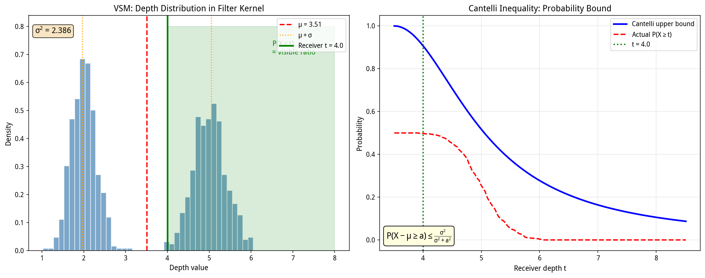

左图：滤波区域内的深度分布（这里是双峰分布，有两层遮挡物）。$\mu$ 是均值，$t$ 是接收点深度，绿色区域是 $P(X \ge t)$。
右图：蓝色线是 Cantelli 不等式给出的上界，红色虚线是真实概率。可以看到上界总是大于等于真实概率（这就是"上界"的含义），但形状相似，可以用来近似。

## 5.8 VSM 的直觉

```
PCF：  深度
       │  ● ● ● ● ● ● ●
       │ ● ● ● ● ● ● ●
       └────────────────
             ↓
          一个个比较，数有多少通过

VSM：  深度分布
       │       ╭───╮
       │     ╭─╯   ╰─╮
       │  ───┼──────────
       └────────────────
             ↓
       只描述均值 μ 和方差 σ²
       然后用公式直接算出概率
```

PCF 说："我真的去看了每一个样本，数有多少通过。"
VSM 说："我不看每一个样本，我只描述这一堆样本的均值和方差，然后用 Cantelli 公式直接估算概率。"

## 5.9 VSM 的巨大优势

传统 PCF：$O(N)$，采样越多越慢。
VSM：只需要 $\mu$ 和 $\sigma^2$ 两个统计量，概率估计本身 $O(1)$（常数次运算）。

不管你模拟多大的软阴影范围，VSM 的运行时开销不变——这对实时渲染至关重要。做大范围软阴影时，VSM 比 PCF 快得多。

## 5.10 VSM 的致命缺陷：Light Bleeding（光泄漏）

### 问题的根源

均值和方差**不能唯一确定**一个概率分布。

举个具体例子：

$$X = \begin{cases} 1, & \text{概率 } 50\% \\ 5, & \text{概率 } 50\% \end{cases}$$

计算它的均值和方差：
- $\mu = E[X] = 1 \times 0.5 + 5 \times 0.5 = 3$
- $E[X^2] = 1^2 \times 0.5 + 5^2 \times 0.5 = 0.5 + 12.5 = 13$
- $\sigma^2 = E[X^2] - \mu^2 = 13 - 9 = 4$

现在考虑另一个完全不同的分布：

$$Y \sim \text{正态分布}(\mu=3, \sigma^2=4)$$

它的均值也是 3，方差也是 4，但分布形状完全不同（一个是两点离散分布，一个是连续正态分布）。

这说明：

$$\boxed{(\mu, \sigma^2) \not\Rightarrow P(X)}$$

**相同的均值和方差，可以对应完全不同的概率分布。**

### 这在阴影中意味着什么？

当场景中有**两层遮挡物**时（比如一个物体在另一个物体后面，两层都在接收者和光源之间），深度分布是双峰的：
- 峰 1：近层遮挡物的深度
- 峰 2：远层遮挡物的深度

VSM 只有 2 阶矩（均值和方差），只能描述"一个均值 + 一个离散程度"，无法区分"两层物体"和"一层均匀分布的物体"。

结果就是：**本该完全阴影的区域（V=0），VSM 算出来 V>0，出现不该有的亮光**。

这就是 **Light Bleeding（光泄漏）**——光"漏"进了本该全黑的阴影区域。

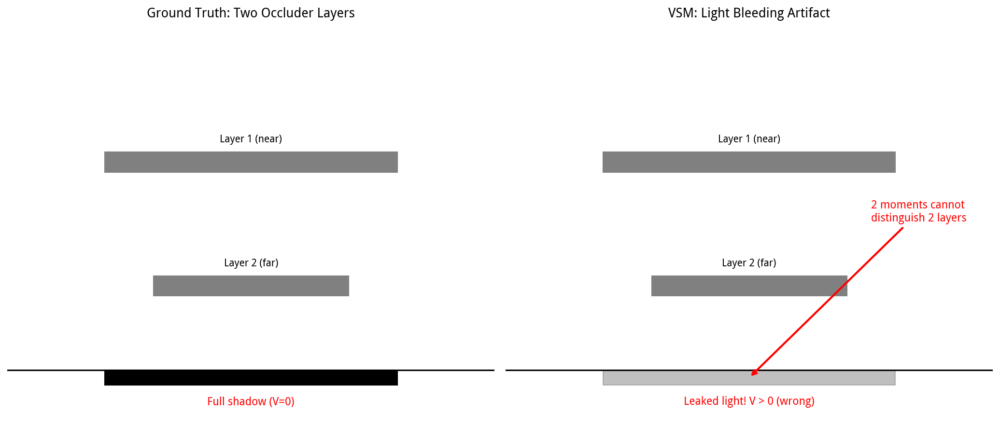

左图：真实情况。两层遮挡物后面应该是完全的阴影（V=0）。
右图：VSM 的结果。因为 2 阶矩无法区分两层遮挡，阴影区域出现了不该有的亮光（V>0）。

---

# 第六章：MSM——用更多矩修复光泄漏

## 6.1 我们遇到了什么问题？

VSM 只有 2 阶矩（均值和方差），信息太少，遇到两层遮挡就光泄漏。

最自然的修复思路：**信息不够？那就多存点。**

MSM（Moment Shadow Mapping，矩阴影贴图）就是存更多阶的矩，来更精确地描述深度分布。

## 6.2 什么是"矩"？

**矩（Moment）** 是概率论中描述分布形状的一组统计量。

定义 $k$ 阶矩：

$$m_k = E[X^k]$$

也就是随机变量 $k$ 次方的期望。

| 阶数 | 公式 | 提供的信息 |
|------|------|-----------|
| 1 阶矩 | $m_1 = E[X] = \mu$ | 平均位置（深度均值） |
| 2 阶矩 | $m_2 = E[X^2]$ | 离散程度（和 $m_1$ 一起算方差） |
| 3 阶矩 | $m_3 = E[X^3]$ | 偏斜（分布是否对称，往左偏还是往右偏） |
| 4 阶矩 | $m_4 = E[X^4]$ | 峰态/尾部（分布有多尖，尾巴有多重） |

> **用编程类比**：矩就像描述一个数组特征的一组统计量。
> - 1阶矩 = 平均值
> - 2阶矩 = 平方的平均值（用来算方差）
> - 3阶矩 = 立方的平均值（用来算偏度）
> - 4阶矩 = 四次方的平均值（用来算峰度）
> 阶数越高，描述越精细，但计算和存储成本也越高。

## 6.3 各阶矩的物理含义

### 1 阶矩（均值）

只知道均值，你只知道分布的"中心"在哪里。比如均值是 3，但你不知道值是集中在 3 附近，还是分散在 1 和 5。

### 2 阶矩（方差）

加入方差后，你知道了分布的"宽度"。比如均值 3、方差 4，说明值大致在 $3 \pm 2$ 的范围内。但你仍然不知道分布的形状——是对称的还是偏的？是单峰还是多峰？

### 3 阶矩（偏度）

3 阶矩描述分布的**偏斜（Skewness）**：
- 偏度 = 0：分布对称（比如正态分布）
- 偏度 > 0：右偏（长尾巴在右边，大部分值偏小）
- 偏度 < 0：左偏（长尾巴在左边，大部分值偏大）

在阴影中，偏度可以帮助区分"近层遮挡物多还是远层遮挡物多"。

### 4 阶矩（峰度）

4 阶矩描述分布的**峰态（Kurtosis）**：
- 峰度高：分布很尖，尾巴重（大部分值集中在均值附近，但偶尔有极端值）
- 峰度低：分布比较平，值比较均匀

在阴影中，峰度可以帮助判断深度分布是"集中在某几层"还是"均匀分布在一个范围内"。

## 6.4 为什么 4 阶矩能解决两层遮挡？

深度分布的 **CDF（累积分布函数，Cumulative Distribution Function）** 定义为：

$$F(t) = P(X \le t)$$

它表示"深度小于等于 $t$ 的样本占多少比例"。CDF 是一个从 0 单调上升到 1 的阶梯函数：每有一层遮挡物，CDF 就跳一阶。

- 1 层遮挡物：CDF 有 1 个台阶
- 2 层遮挡物：CDF 有 2 个台阶
- $n$ 层遮挡物：CDF 有 $n$ 个台阶

VSM 用 2 阶矩，最多只能拟合 1 个台阶的 CDF → 遇到两层物体就崩。
MSM 用 4 阶矩，可以拟合 2 个台阶的 CDF → 能处理两层遮挡。

> **注意**："m 阶矩能表示 m/2 个台阶"是一个工程直觉，不是对所有分布都严格成立的数学定理。更准确的说法是：有限阶矩对深度分布施加更多约束，从而改善 CDF 重建；对于某些有限层数的离散深度模型，可以得到更明确的可恢复性结果。实际场景中 4 阶矩通常已经够用了，因为大部分时候不会有超过 2 层的明显遮挡。

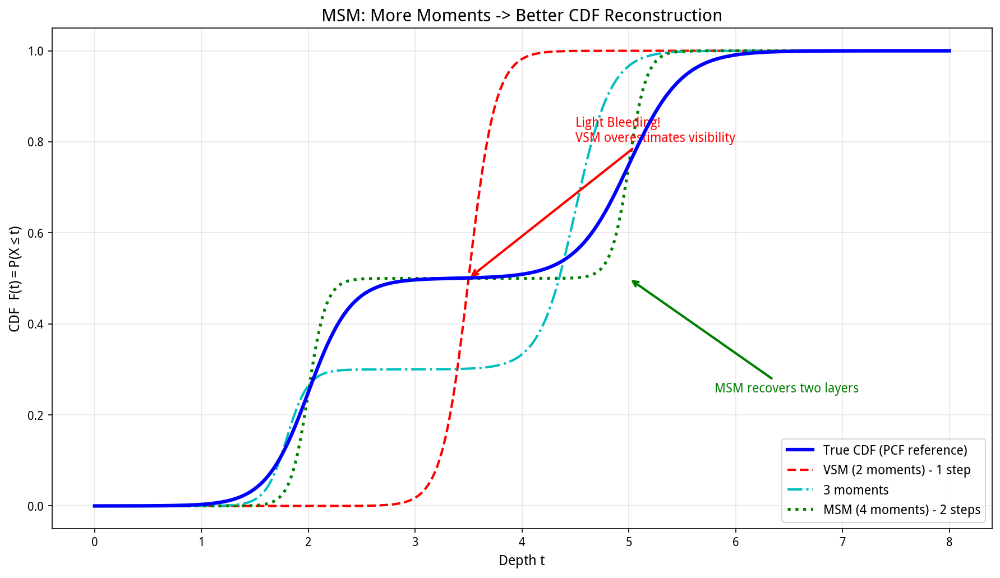

蓝色线：真实 CDF（两层遮挡，两个台阶）。
红色虚线：VSM（2阶矩），只能拟合1个台阶，在两层之间严重偏离 → 光泄漏。
绿色点线：MSM（4阶矩），可以拟合2个台阶，和真实 CDF 几乎重合 → 消除光泄漏。

## 6.5 MSM 工作流程

1. **生成阶段**：Shadow Map 存 4 个通道：
   ```
   R = depth
   G = depth²
   B = depth³
   A = depth⁴
   ```
   占满 RGBA 四个通道。

2. **模糊/范围查询**：对这 4 张图分别做模糊（或用 Mipmap/SAT），得到窗口内 4 个矩的平均值：$\bar{z}, \overline{z^2}, \overline{z^3}, \overline{z^4}$。

3. **运行时 - CDF 重建**：用这 4 个矩，重建一个分段阶跃 CDF 函数。这个重建的 CDF 严格匹配 4 阶矩（即它的 1~4 阶矩等于我们存的那 4 个值）。

4. **运行时 - 查询**：输入当前点深度 $t$，直接读重建出的 CDF 在 $t$ 处的取值 $F(t) = P(X \le t)$，然后可见性 $V = 1 - F(t) = P(X \ge t)$。

不再使用切比雪夫不等式那种粗糙上界，而是直接重建近似的 CDF，精度高很多。

## 6.6 MSM 的代价

| | VSM | MSM |
|---|-----|-----|
| 通道数 | 2（RG） | 4（RGBA） |
| 内存 | 基准 | 翻倍 |
| 运行时计算 | 简单公式（1次除法） | CDF重建（需求根/解方程） |
| 能处理的遮挡层数 | 1层 | 2层 |
| 光泄漏 | 严重 | 大幅减轻 |

MSM 仍然有上限：3 层遮挡需要 6 阶矩，但纹理最多 4 通道（RGBA），放不下了。实际场景中 2 层通常够用。

---

# 第七章：Range Query——怎么快速拿到区域均值？

## 7.1 我们遇到了什么问题？

VSM 和 MSM 都有一个前提：我们需要快速计算一个区域内的平均值。

具体来说，VSM 需要 $E[X]$ 和 $E[X^2]$，MSM 需要 $E[X], E[X^2], E[X^3], E[X^4]$。

这些都是"对 Shadow Map 上一个区域求平均"的操作，叫做 **Range Query（范围查询）**。

如果每次都手动遍历区域内的所有像素求平均，那区域一大就太慢了。我们需要预计算的数据结构来加速。

有两种主流方案：Mipmap 和 SAT。

## 7.2 什么是 LOD？

在讲 Mipmap 之前，先解释一个概念：**LOD（Level of Detail，细节层次）**。

LOD 的思想是：根据物体离相机的距离，使用不同精度的模型。离得远的物体用低精度模型（因为看不清细节），离得近的用高精度模型。这样可以节省性能。

Mipmap 就是纹理的 LOD——同一纹理存多个不同分辨率的版本，根据采样范围选择合适的分辨率。

## 7.3 Mipmap：硬件友好的分层平均

### 核心思想

Mipmap 的核心是不断做 $2 \times 2$ 区域平均：

$$M_1 = \frac{1}{4}(X_1 + X_2 + X_3 + X_4)$$

把原图（Level 0）每 2×2 个像素取平均，得到宽高都减半的 Level 1。
然后对 Level 1 再做 2×2 平均，得到 Level 2。
依此类推，直到 1×1。

形成 $L_0, L_1, L_2, \cdots$ 的层级结构：
- $L_0$：原图，分辨率最高
- $L_1$：宽高折半
- $L_2$：宽高再折半
- ...
- $L_n$：1×1，整张图的平均值

### 怎么用 Mipmap 做范围查询？

当需要查询一个边长为 $R$ 的正方形区域的平均值时：

1. 计算对应的 LOD 层级：$\text{LOD} \approx \log_2 R$
2. 直接从那一层采样 1-2 次

比如要查询 8×8 区域的平均，不用读 64 个像素，直接去 $L_3$（原图缩小 8 倍）采样 1 个像素——这个像素本身就是原图那 8×8 区域预先算好的平均值。

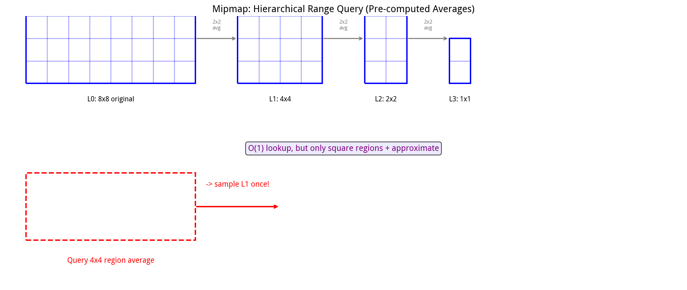

### Mipmap 的特点

| 方面 | 说明 |
|------|------|
| 查询形状 | **只能正方形**区域。长方形区域会不准 |
| 精度 | **近似**。即使三线性插值（在两个 LOD 层级之间平滑过渡）也有误差 |
| GPU 支持 | **硬件原生支持**。GPU 的纹理采样单元内置了 Mipmap 选择和三线性插值，极快 |
| 构建 | 简单。逐层 2×2 平均 |
| 内存 | 原图的 1/3 额外开销（所有层加起来是原图的 $1 + 1/4 + 1/16 + \cdots = 4/3$ 倍） |
| 数值问题 | 少。因为每层都是平均，数值不会爆炸 |

## 7.4 SAT：精确的二维前缀和

### 核心思想

SAT（Summed Area Table，总和面积表）就是**二维前缀和**。

定义：

$$S(x, y) = \sum_{i \le x} \sum_{j \le y} I(i, j)$$

$S(x, y)$ 表示从左上角 $(0,0)$ 到 $(x,y)$ 的矩形区域内所有像素值的总和。

> **用编程类比**：一维前缀和就是 `prefix[i] = prefix[i-1] + array[i]`，然后求区间和 `sum(l..r) = prefix[r] - prefix[l-1]`。二维前缀和就是这个思想的推广，用四个角的加减来求任意矩形的和。

### 怎么用 SAT 做范围查询？

查询任意矩形 $[x_1, x_2] \times [y_1, y_2]$ 的总和：

$$\boxed{R = S(x_2, y_2) - S(x_1-1, y_2) - S(x_2, y_1-1) + S(x_1-1, y_1-1)}$$

**为什么是这个公式？** 用容斥原理理解：
- $S(x_2, y_2)$：从左上角到右下点的大矩形总和
- 减去 $S(x_1-1, y_2)$：去掉左边多余的部分
- 减去 $S(x_2, y_1-1)$：去掉上边多余的部分
- 加回 $S(x_1-1, y_1-1)$：左上角被减了两次，要加回来一次

然后均值 = $R / \text{矩形面积}$。

只需要 4 次纹理查询，$O(1)$，而且是**精确值**。

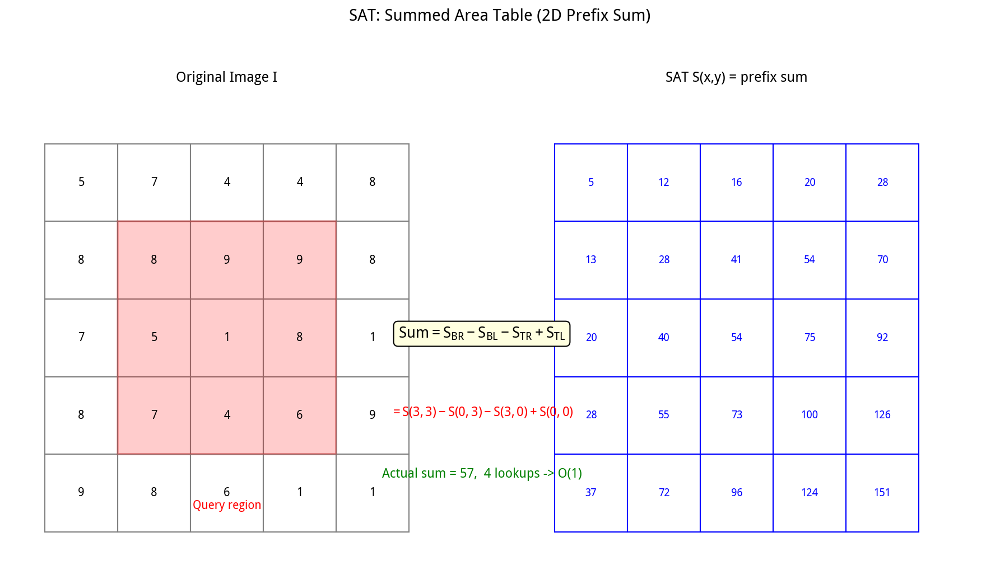

### SAT 的特点

| 方面 | 说明 |
|------|------|
| 查询形状 | **任意矩形**（长方形、正方形都可以），精确 |
| 精度 | **精确**。没有近似误差 |
| GPU 支持 | **没有硬件原生支持**。需要在 Shader 中手动做 4 次采样 + 加减 |
| 构建 | 成本较高。需要逐行做前缀和，再逐列做前缀和（或反过来） |
| 内存 | 和原图一样分辨率，但需要**高精度**（32-bit float），防止累加溢出 |
| 数值问题 | **明显**。大分辨率下总和巨大，浮点数精度丢失，可能出现误差 |

## 7.5 本质对比

| | Mipmap | SAT |
|---|---|---|
| 核心 | 层级平均（预计算各种尺寸的方块平均） | 二维前缀和（预计算到每个点的累积和） |
| 查询形状 | 只能正方形 | 任意矩形 |
| 精度 | 近似 | 精确 |
| GPU 友好度 | 极高（硬件加速） | 较低（手动实现） |
| 构建成本 | 低 | 高 |
| 数值问题 | 少 | 明显（溢出/精度） |

这体现了实时渲染一个经典原则：

$$\boxed{\text{数学上最优} \neq \text{硬件上最优}}$$

SAT 数学上更优（精确、任意矩形），但 Mipmap 因为 GPU 硬件原生支持，在实际游戏中更常用。**算法的选择不仅要看数学性质，还要看硬件能不能高效执行。**

## 7.6 和 VSM/MSM 的关系

VSM 需要拿到区域内的 $\mu$ 和 $m_2$，MSM 需要拿到 $m_1, m_2, m_3, m_4$。怎么拿？

- **方案 A（Mipmap）**：对 depth、depth²（以及 depth³、depth⁴）各生成一套 Mipmap。要多大窗口平均，选对应 LOD 采样。
  - 优点：硬件快
  - 缺点：只能正方形窗口；PCSS 算出来的滤波窗口可能是长方形，这时候就不准

- **方案 B（SAT / SAVSM）**：对各阶矩图各生成一张 SAT。运行时用 SAT 公式查询任意矩形。
  - 优点：任意矩形、精确
  - 缺点：生成慢、容易精度爆炸、无硬件支持

---

# 第八章：Distance Field Soft Shadows——另一条完全不同的路

## 8.1 两条路线的根本区别

前面讲的所有技术（Shadow Map / PCF / PCSS / VSM / MSM）都属于同一条路线：

> **基于 Shadow Map 的深度采样**——从光源视角渲染深度图，然后通过深度比较来判断遮挡。

现在进入第二条完全不同的路线：

> **基于距离场的几何查询**——直接存储场景中每个点到最近表面的距离，通过光线步进和距离查询来判断遮挡。

这两条路线的核心区别在于**数据表示**：
- Shadow Map 存的是 **2D 深度**（从光源看出去的最近表面深度）
- Distance Field 存的是 **3D 距离**（空间中每个点到最近表面的距离）

## 8.2 什么是 Distance Field？

**距离场（Distance Field）** 是一个函数 $d(\mathbf{x})$，表示：

$$\boxed{d(\mathbf{x}) = \text{点 } \mathbf{x} \text{ 到场景中最近表面的距离}}$$

其中 $\mathbf{x} = (x, y, z)$ 是三维空间中的一个点。

### 例子：球体的距离场

对于一个球心在 $\mathbf{c}$、半径为 $r$ 的球体：

$$d(\mathbf{x}) = \|\mathbf{x} - \mathbf{c}\| - r$$

**逐部分解释**：
- $\|\mathbf{x} - \mathbf{c}\|$：点 $\mathbf{x}$ 到球心的距离（向量的模长）
- 减去半径 $r$：得到点到球面的最近距离

判断点的位置：
- $d(\mathbf{x}) > 0$：点在球体外部（到球面的距离是正的）
- $d(\mathbf{x}) = 0$：点在球面上
- $d(\mathbf{x}) < 0$：点在球体内部

如果距离场能区分内部和外部（负值表示内部），就叫做 **SDF（Signed Distance Field，有符号距离场）**。

> **用编程类比**：Distance Field 就像一个 3D 数组 `float distField[][][]`，每个体素存一个浮点数，表示这个位置到最近物体表面的距离。查询距离就是一次数组访问 + 三线性插值。

## 8.3 Distance Field 比 Shadow Map 多了什么信息？

Shadow Map 只能告诉你："从光源往这个方向看，最近表面在哪里。"它是一个 2D 的、以光源为中心的表示。

Distance Field 告诉你："空间中任意一个点，离最近的表面还有多远。"它是一个 3D 的、全空间的表示。

这个"离最近表面还有多远"的额外信息，对于光线追踪极其重要——它让我们可以**大步前进**而不是一小步一小步地挪。

## 8.4 Sphere Tracing：自适应光线步进

### 我们遇到了什么问题？

要沿方向 $\mathbf{r}$ 做光线追踪 $\mathbf{p}(t) = \mathbf{p}_0 + t\mathbf{r}$，最笨的方法是固定小步长：

```
t += 0.01
检查有没有撞到物体
t += 0.01
检查有没有撞到物体
...
```

这需要大量步长，特别是当光线离物体很远的时候，大部分步长都在"空走"。

### Sphere Tracing 的核心思想

如果我们知道当前点 $\mathbf{p}$ 到最近表面的距离 $d(\mathbf{p})$，就可以**直接走 $d(\mathbf{p})$ 这么远**！

$$\boxed{\mathbf{p}_{n+1} = \mathbf{p}_n + d(\mathbf{p}_n) \cdot \mathbf{r}}$$

### 为什么这样走是安全的？

如果 $d(\mathbf{p}) = 5$，意味着以 $\mathbf{p}$ 为中心、半径 5 的球体内部**没有任何场景表面**（因为最近的表面在 5 以外）。

所以从 $\mathbf{p}$ 出发，沿任何方向走最多 5，都不会撞到物体。走正好 5 是安全的（最多刚好擦到表面）。

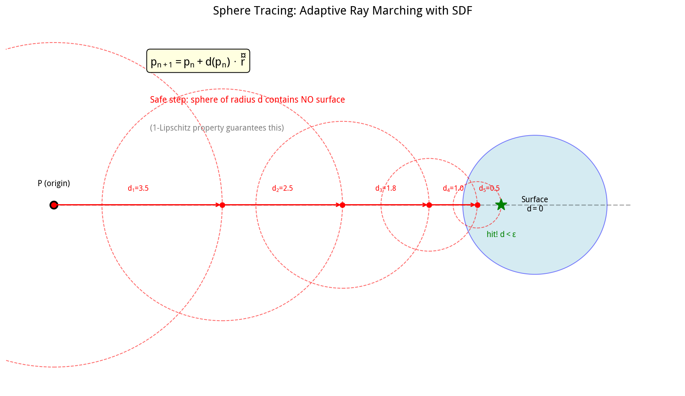

### 算法步骤

1. 起点 $\mathbf{p}_0 = \mathbf{x}$（接收点位置）
2. 计算当前点到最近表面的距离 $d_n = d(\mathbf{p}_n)$
3. 沿光线方向前进 $d_n$：$\mathbf{p}_{n+1} = \mathbf{p}_n + d_n \cdot \mathbf{r}$
4. 重复步骤 2-3，直到：
   - $d_n < \epsilon$：距离表面足够近，认为撞到了 → 有遮挡
   - $t_n > t_{\max}$：走了足够远还没撞到 → 没有遮挡

其中 $\epsilon$ 是一个很小的阈值（比如 0.001），用来控制精度。

### 自适应采样的优势

- 远离物体时：$d(\mathbf{p})$ 大 → 大步跨 → 几步就走过空旷区域
- 靠近物体时：$d(\mathbf{p})$ 小 → 小步走 → 精细地逼近表面

这比固定步长高效得多，特别是在空旷场景中。

> **名字的由来**：每一步都以当前点为球心、以 $d(\mathbf{p})$ 为半径画一个球，这个球内没有表面。然后沿光线方向走到这个球的边缘。所以叫 Sphere Tracing（球体追踪）。

## 8.5 Lipschitz 性质：Sphere Tracing 的数学基础

Distance Field 满足一个重要的数学性质：**1-Lipschitz 连续**。

$$\boxed{|d(\mathbf{x}) - d(\mathbf{y})| \le \|\mathbf{x} - \mathbf{y}\|}$$

**这句话是什么意思？**

"距离函数的变化量，不会超过空间位置的变化量。"

换句话说：当你从点 $\mathbf{x}$ 移动到点 $\mathbf{y}$，移动了 $\|\mathbf{x}-\mathbf{y}\|$ 这么远，距离场的值最多变化 $\|\mathbf{x}-\mathbf{y}\|$。距离函数不会"变化得比空间距离更快"。

### 为什么这能保证 Sphere Tracing 不穿物体？

假设 $d(\mathbf{x}) = 5$。根据 Lipschitz 性质，对于任意 $\mathbf{y}$ 满足 $\|\mathbf{x} - \mathbf{y}\| < 5$：

$$|d(\mathbf{y}) - d(\mathbf{x})| \le \|\mathbf{x} - \mathbf{y}\| < 5$$

$$d(\mathbf{y}) > d(\mathbf{x}) - 5 = 5 - 5 = 0$$

所以在以 $\mathbf{x}$ 为中心、半径 5 的球体内，$d(\mathbf{y}) > 0$，即没有表面。

因此可以安全地前进 5。**这不是经验规则，是有严格数学保证的。**

## 8.6 Distance Field 硬阴影

从接收点 $P$ 向光源 $L$ 发射 Shadow Ray：

$$\mathbf{r} = \frac{L - P}{\|L - P\|}, \quad \mathbf{p}(t) = P + t\mathbf{r}$$

用 Sphere Tracing 沿光线步进，不断查询 $d(\mathbf{p}(t))$：

- 如果 $d(\mathbf{p}(t)) < \epsilon$：在到达光源之前撞到了物体 → 有遮挡 → $V = 0$
- 如果走到 $t \ge \|L - P\|$ 还没碰撞 → 没有遮挡 → $V = 1$

这只能得到硬阴影（0 或 1）。我们想要 $0 < V < 1$ 的软阴影。

## 8.7 Distance Field 软阴影：核心公式

### 关键思想

Distance Field Soft Shadows 的核心洞察：

> 不要只判断"有没有撞到物体"，而是利用射线沿途的距离场值，估计这条光线距离遮挡物有多近。离遮挡物越近，阴影越深。

### 经典公式

$$\boxed{S = \min_t \left( k \cdot \frac{d(\mathbf{p}(t))}{t} \right)}$$

实现中，在 Sphere Tracing 的每一步更新：

$$S = \min\left(S,\ k \cdot \frac{h}{t}\right)$$

**逐符号解释**：

| 符号 | 含义 |
|------|------|
| $S$ | 软阴影可见性（0到1之间），最终作为 $V$ 使用 |
| $h = d(\mathbf{p}(t))$ | 当前光线点到最近表面的距离 |
| $t$ | 当前光线已经行进的距离（从接收点算起） |
| $k$ | 软阴影强度参数（控制阴影有多软，类似光源大小） |
| $\min_t$ | 沿整条光线取最小值 |

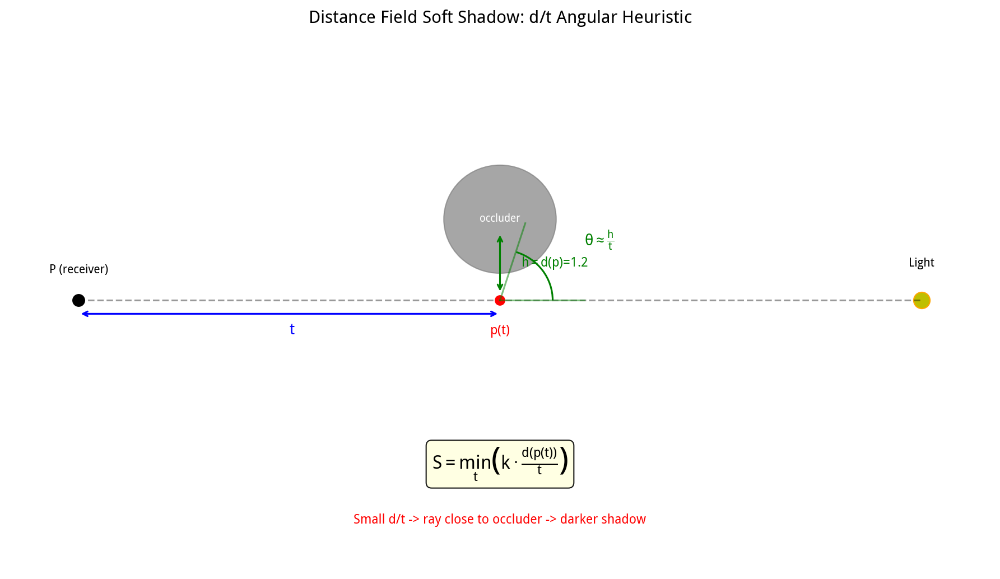

## 8.8 为什么 $d/t$ 合理？

这是 Distance Field Soft Shadow 最值得理解的地方。

考虑光线上一点 $\mathbf{p}(t)$，它距离遮挡物 $h$，距离接收点 $t$。

对于小角度，有近似：

$$\theta \approx \frac{h}{t}$$

其中 $\theta$ 是从接收点看过去，遮挡物相对于光线的角偏移量。

所以 $d/t$ 本质上是在估计**遮挡物在当前距离尺度下占据的角度**：

- $h/t$ 大：遮挡物离光线远，角偏移大 → 光线被挡住的部分少 → 阴影浅
- $h/t$ 小：遮挡物离光线近，角偏移小 → 光线被挡住的部分多 → 阴影深
- $h/t \to 0$：光线几乎擦过遮挡物 → 接近全黑

### 具体数值例子

- $h = 1, t = 10$：$h/t = 0.1$，遮挡物相对于传播距离比较小，阴影较浅
- $h = 0.1, t = 10$：$h/t = 0.01$，光线非常接近遮挡物，阴影很深

> **$d/t$ 可以看作光线"危险程度"的几何度量**——值越小，光线越危险（越可能被遮挡），阴影越深。

## 8.9 为什么取 Minimum？

沿光线可能有多个位置靠近遮挡物。某一处 $d/t$ 特别小（光线特别接近遮挡物），那一处就应该决定最终的软阴影强度——因为最危险的那一段决定了光线被遮挡的程度。

所以取整条光线上的最小值：

$$S = \min_t k \cdot \frac{d(t)}{t}$$

这实际上是在找**沿光线最危险的那一段**。

## 8.10 简化伪代码

```cpp
float SoftShadow(
    float3 origin,      // 接收点 P
    float3 lightDir,    // 指向光源的单位方向 r
    float maxDistance,  // 到光源的距离
    float softness)     // 软阴影强度 k
{
    float result = 1.0;  // 初始化为全亮
    float t = EPSILON;   // 从很小的距离开始（避免起点自相交）

    for (int i = 0; i < MAX_STEPS; ++i)
    {
        float3 p = origin + lightDir * t;  // 当前光线点
        float h = DistanceField(p);          // 到最近表面的距离

        if (h < EPSILON) return 0.0;        // 撞到了，全黑

        // 更新软阴影：取当前值和 k*h/t 的较小值
        result = min(result, softness * h / t);

        t += h;  // Sphere Tracing：前进 h 的距离

        if (t >= maxDistance) break;  // 到达光源，结束
    }

    return saturate(result);  // 限制在 [0, 1] 范围内
}
```

注意 $h = d(p)$ 同时干了两件事：
1. 决定 Sphere Tracing 的步长（`t += h`）
2. 参与软阴影估计（`softness * h / t`）

## 8.11 它真的在模拟面积光源吗？

需要严谨地说：**经典 DFSS 公式不是面积光源积分的严格数学解**。

$$S = \min_t k \cdot \frac{d(t)}{t}$$

它是一种：

$$\boxed{\text{Geometric Heuristic（几何启发式）}}$$

它利用距离、角度、遮挡几何和光源尺寸参数 $k$，产生符合软阴影规律的可见性近似。和 PCSS 的物理来源不同：

- **PCSS** 更接近 Area Light Projection（面积光源投影）——通过相似三角形直接计算半影宽度，物理基础更明确
- **DFSS** 更接近 Distance Geometry → Visibility Approximation（距离几何 → 可见性近似）——用距离场的几何信息构造一个看起来合理的软阴影，是一种经验性的近似

> 这就像物理渲染中的"经验模型"vs"物理模型"：Blinn-Phong 是经验模型（看起来合理但没有严格物理推导），PBR 是物理模型（基于微表面理论推导）。DFSS 更像前者，PCSS 更像后者。

## 8.12 与 Cone Tracing 的联系

可以把面积光源理解成一个光锥：
- 点光源：$\theta = 0$（无限细的线）
- 面积光源：$\theta > 0$（有宽度的锥）

软阴影就是检查一个逐渐扩张的光锥是否被场景几何截断。Distance Field 提供的"到几何体的距离"可以用来判断光锥是否接近/穿过遮挡物。

这就是 DFSS 与 Cone Tracing（光锥追踪）的深层联系：$k \cdot d/t$ 中的 $k$ 可以理解为光锥的半角正切，$d/t$ 是当前位置光锥半径和到遮挡物距离的比值。

## 8.13 工程现实：Voxelized Distance Field

实际游戏中通常不用完美解析 SDF（因为场景太复杂，写不出解析式），而是：

```
3D Scene
   ↓ Voxelization（体素化）
Voxel Grid
   ↓ Distance Transform（距离变换）
3D Distance Field Texture
   ↓ GPU Sampling（GPU 采样）
```

查询 $d(\mathbf{x})$ 实际上是在 3D 纹理中做三线性插值。

### 误差来源

| 误差来源 | 说明 |
|---------|------|
| Voxelization | 连续几何被离散成体素，细节丢失 |
| Resolution | 距离场分辨率有限，薄物体可能丢失 |
| Interpolation | 三线性插值在不连续处有误差 |
| Approximation | 某些距离场不是真正的精确 SDF |

所以实际的 $\hat{d}(\mathbf{x}) \neq d(\mathbf{x})$，有误差。

## 8.14 Distance Field 的优缺点

### 优势

1. **不需要传统 Shadow Map**：不受 Shadow Map 分辨率限制，没有 Shadow Aliasing
2. **不需要大量固定采样**：Sphere Tracing 自适应步长，空旷区域大步跨
3. **天然表达几何距离**：这是 Shadow Map 很难直接做到的
4. **适合大型静态场景**：UE 的 Distance Field AO/Shadow 就是用这个，特别适合大规模开放世界

### 劣势

1. **内存大**：3D 距离场 $O(N_x N_y N_z)$，比 2D Shadow Map 贵得多
2. **动态物体更新难**：动态几何的距离场更新成本高，通常只对静态物体预计算
3. **薄几何体问题**：非常薄的物体容易因体素化丢失细节
4. **不是严格的面积光源积分**：DFSS 是几何启发式近似，不是物理精确解

---

# 第九章：统一框架——所有技术的共同本质

## 9.1 两条技术路线

```
                    阴影问题
                       │
          ┌────────────┴────────────┐
          ▼                         ▼
      Shadow Map              Distance Field
      (2D 深度表示)            (3D 距离表示)
          │                         │
     ┌────┴────┐              Sphere Tracing
     │         │                    │
    PCF       VSM                   ▼
     │         │           Distance Soft Shadow
    PCSS      MSM
```

**第一条路线（Shadow Map 系）**：Visibility → Depth Sampling（可见性 → 深度采样）
- 从光源视角渲染深度图
- 通过深度比较/统计来估计可见性
- 代表：Shadow Map, PCF, PCSS, VSM, MSM

**第二条路线（Distance Field 系）**：Visibility → Distance Geometry（可见性 → 距离几何）
- 预计算全空间的距离场
- 通过 Sphere Tracing + 距离查询来估计可见性
- 代表：Distance Field Soft Shadows

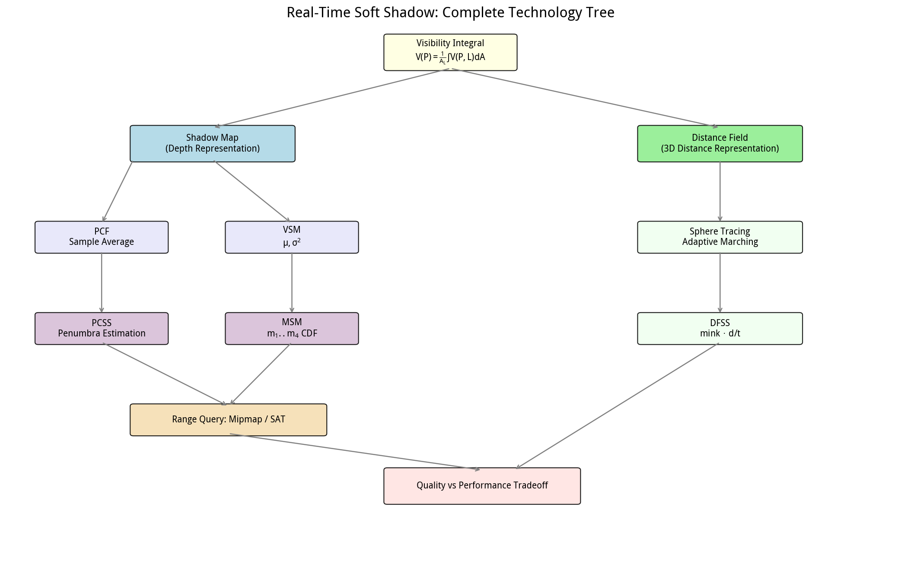

## 9.2 一个统一抽象

所有阴影技术都可以看成三个阶段：

$$\boxed{\text{Geometry（几何）} \rightarrow \text{Representation（表示）} \rightarrow \text{Visibility Approximation（可见性近似）}}$$

| 技术 | 表示（Representation） | 可见性近似方法 |
|------|----------------------|--------------|
| Shadow Map | Depth Map（2D深度图） | Depth Test（单次深度比较） |
| PCF | Depth Map | Multiple Comparisons + Average（多次比较取平均） |
| PCSS | Depth Map | Penumbra Estimation + Adaptive PCF（半影估计+自适应PCF） |
| VSM | Moments（2阶矩：$\mu, \sigma^2$） | Probability Bound（Cantelli概率上界） |
| MSM | Higher Moments（4阶矩） | CDF Reconstruction（CDF重建） |
| Distance Field | 3D Distance Field（3D距离场） | Sphere Tracing + Distance-Based Visibility（球体追踪+距离可见性） |

## 9.3 数据表示换计算量

这是贯穿整个领域的核心思想：**用不同的数据表示方式，换取计算量**。

```
PCF
│ 保存 N 个深度样本
▼
Sample Space（样本空间）
│  计算：O(N) 次比较
│
▼
VSM
│ 压缩成 2 个统计量 (μ, σ²)
▼
Moment Space（矩空间）
│  计算：O(1) 次公式
│
▼
MSM
│ 增加到 4 个统计量 (m₁..m₄)
▼
Higher-Order Moment Space（高阶矩空间）
│  计算：O(1) 次 CDF 重建
```

- PCF 存 N 个样本 → 计算慢（$O(N)$）但信息完整
- VSM 存 2 个统计量 → 计算快（$O(1)$）但信息丢失（光泄漏）
- MSM 存 4 个统计量 → 计算中等（$O(1)$ 但更重），信息更多

Distance Field 则是另一种表示：存 3D 距离而不是 2D 深度，空间信息更丰富，但内存更贵。

> **这是计算机科学中一个非常普遍的思想**：用空间（内存/存储）换时间（计算），或者用数据表示的设计来换取算法效率。数据库的索引、图像处理的金字塔、搜索算法的预处理，都是同一个思想。

## 9.4 四种核心方法的数学本质

| 方法 | 数学本质 | 涉及的数学领域 |
|------|---------|--------------|
| Shadow Map | 离散深度可见性测试 | 离散化、深度比较 |
| PCF | 样本平均 / Monte Carlo 数值积分 | 概率论、Monte Carlo方法 |
| PCSS | 几何投影（相似三角形）+ 自适应数值积分 | 射影几何、相似三角形 |
| VSM | 概率统计 + Cantelli 矩上界 | 概率论、不等式、矩方法 |
| MSM | 高阶矩 + CDF 重建 | 矩理论、逆问题、函数逼近 |
| DFSS | 距离场 + Sphere Tracing + 几何启发式 | 隐式几何、Lipschitz连续、数值方法 |

## 9.5 技术演进路线

```
Hard Shadow（硬阴影）
    ↓ 问题：边缘锯齿（Aliasing）
PCF（固定核滤波）
    ↓ 问题：核大小固定，不随距离变化
PCSS（自适应半影估计）
    ↓ 问题：需要大量采样（Blocker Search + PCF）
VSM（O(1) 统计估计）
    ↓ 问题：2阶矩信息不够，光泄漏（Light Bleeding）
MSM（高阶矩 CDF 重建）
    ↓ 问题：4通道上限，3层以上遮挡仍有问题
    ↓ 以及内存和计算开销增加

与此同时另一条完全独立的路线：
Distance Field（距离场）
    + Sphere Tracing（自适应球体追踪）
    + d/t 几何启发式
    → 直接从几何表示估计可见性
```

每一个新技术都是为了解决前一个技术的某个具体缺陷，一环扣一环。这就是技术演进的典型模式。

---

# 第十章：最重要的公式速查表

## 软阴影的本质
$$V(P) = \frac{1}{A_L} \int_{A_L} V(P, L)\, dA$$

## Shadow Map
$$V = \mathbf{1}[z_r \le D(u, v)]$$

## PCF
$$V = \frac{1}{N} \sum_{i=1}^{N} \mathbf{1}[z_r \le z_i]$$

## PCSS 半影宽度
$$w_P = w_L \cdot \frac{d_R - d_B}{d_B}$$

## VSM 均值和方差
$$\mu = E[X], \quad \sigma^2 = E[X^2] - E[X]^2$$

## Cantelli 不等式
$$P(X \ge t) \le \frac{\sigma^2}{\sigma^2 + (t - \mu)^2}$$

## MSM 高阶矩
$$m_k = E[X^k], \quad k = 1, 2, 3, 4$$

## Mipmap LOD 选择
$$\text{LOD} \approx \log_2 R$$

## SAT 矩形查询
$$R = S(x_2, y_2) - S(x_1-1, y_2) - S(x_2, y_1-1) + S(x_1-1, y_1-1)$$

## Sphere Tracing
$$\mathbf{p}_{n+1} = \mathbf{p}_n + d(\mathbf{p}_n) \cdot \mathbf{r}$$

## Lipschitz 性质
$$|d(\mathbf{x}) - d(\mathbf{y})| \le \|\mathbf{x} - \mathbf{y}\|$$

## Distance Field 软阴影
$$S = \min_t \left( k \cdot \frac{d(\mathbf{p}(t))}{t} \right)$$

---

# 第十一章：最终理解

## 11.1 如果只记住一件事

$$\boxed{\text{软阴影不是模糊。}}$$

软阴影的真正来源是**面积光源**，数学本质是**对光源区域上的可见性进行积分**：

$$V(P) = \frac{1}{A_L} \int_{A_L} V(P, L)\, dA$$

不同算法只是选择了不同的近似策略：

- **PCF**：我直接采很多次，然后平均。$\frac{1}{N}\sum V_i$
- **PCSS**：我先根据几何关系（相似三角形）估计应该采多大范围，再做 PCF。$w_P = w_L \frac{d_R-d_B}{d_B}$
- **VSM**：我不想一个个采样，我用均值和方差描述整个区域，再用 Cantelli 不等式估算概率。$\mu, \sigma^2$
- **MSM**：两个统计量还不够，我保存更多阶矩，重建 CDF。$m_1, m_2, m_3, m_4$
- **DFSS**：我不从 Shadow Map 推断遮挡，我直接问光线沿途距离几何体有多近，用 $d/t$ 估计阴影。$d(\mathbf{x})$ + Sphere Tracing

## 11.2 实时图形学真正高深的地方

不是把公式写出来，而是回答：

> **在固定的 16.67ms 帧预算里，我应该牺牲什么，保留什么，以及用什么数学表示把昂贵的问题转换成 GPU 擅长的问题？**

这正是 PCF、PCSS、VSM、MSM 和 Distance Field Soft Shadows 背后的共同思想：

- PCF 牺牲了物理正确性（固定核），换来了简单
- PCSS 牺牲了性能（两轮采样），换来了物理正确的半影
- VSM 牺牲了精度（2阶矩，光泄漏），换来了 O(1) 性能
- MSM 牺牲了内存（4通道），换来了更少的光泄漏
- DFSS 牺牲了内存（3D纹理）和物理精确性，换来了无 Shadow Aliasing 的软阴影

**没有完美的方案，只有在特定约束下的最优权衡。**

## 11.3 这个专题训练了什么能力？

软阴影看起来只是一个"阴影效果"，但它同时涉及：

$$\boxed{\text{几何学} + \text{概率论} + \text{数值积分} + \text{统计学} + \text{信号处理} + \text{GPU 架构} + \text{计算机图形学}}$$

| 技术 | 训练的能力 |
|------|-----------|
| PCF | Sampling（采样理论）、Monte Carlo 积分 |
| PCSS | Projective Geometry（射影几何）、相似三角形 |
| VSM | Probability（概率论）、不等式、矩方法 |
| MSM | Moment Theory（矩理论）、函数逼近、逆问题 |
| Mipmap / SAT | Range Query（范围查询）、预计算、数据结构 |
| Distance Field | Implicit Geometry（隐式几何）、Lipschitz连续、数值方法 |

所以软阴影是一个非常典型的现代实时渲染专题：**同一个物理问题，可以通过完全不同的数据结构、数学模型和 GPU 算法得到近似解。**

理解了这条技术路线，你就理解了实时渲染中"问题→表示→近似→硬件优化"的核心思维方式。

---

*本文档基于《实时软阴影技术完整知识体系》笔记整理，大幅扩充了通俗直觉解释、数学符号说明、Cantelli 不等式完整推导、PCSS 相似三角形逐步推导，以及 12 张技术示意图。面向有编程基础但图形学/概率论刚入门的读者。*
